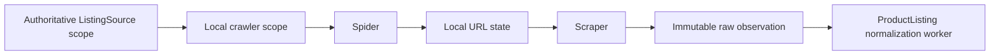

# Crawler

The `crawler` crate discovers and extracts generic product evidence from enabled `WEB_CRAWL` ListingSources. It has its own Postgres state for domains, URLs, schemas, retries, budgets, and review artifacts.

It is not a ProductListing writer. It sends immutable raw observations to the ProductListing raw-capture use case; the normalization worker is the sole authority that turns raw evidence into canonical ProductListings. The crawler does not query canonical ProductListing tables, create ProductListing events, or assign Parties, sellers, auctioneers, auctions, or lot facts.

## Flow

Each spider or scraper pass first refreshes the complete authoritative ListingSource scope. A failed refresh skips that pass. `crawl_enabled` admits work only; disabling a source retains its crawler history and configuration.

A ListingSource keeps its business identity from the authoritative source. The crawler never derives it from a domain or URL. It mirrors only the local work scope, including `WEB_CRAWL` enablement and an optional fallback currency. The fallback applies only when an extracted price has no currency hint.

## Local state

Crawler-local Postgres is authoritative for crawler operations:

- configured domains and crawl roots;
- discovered URL class, disposition, scrape fingerprint, and retry metadata;
- cached product and removed-page schemas;
- LLM budget accounting; and
- review artifacts and their audit state.

A URL belongs to one configured `(listing_source_id, domain_id)` pair. Exact URLs cannot move between domains or sources. Removing a domain removes its URL state and domain-scoped URL-pattern reviews.

Crawler IDs exposed by the review service use TypeIDs: domains `cd`, reviews `cr`, review pages `crp`, and review URLs `cru`. Postgres stores their backing UUIDs. See [object IDs](../object-ids.md).

## Binaries

- `server` runs the scheduled crawler and review console.
- `demo` exercises the local crawler flow with crawler-local migrations.
- `demo-spider` and `demo-scraper` are focused development entry points for their respective passes.
- `fetch-fixture` saves source HTML for stable parser and schema snapshots; it is not a production ingestion path.

## Boundaries

- [ListingSource contract](../party-and-listing-source.md) owns business source identity and `WEB_CRAWL` configuration.
- [ProductListing event flow](../events/flow.md#productlisting-write-flow) owns raw capture and normalization.
- [Workspace architecture](../arch.md) owns dependency and authority rules.
- [Networking](networking.md), [scheduling and retries](scheduling-and-retries.md), [extraction and review](extraction-and-review.md), and [operations](operations.md) define crawler-specific contracts.
