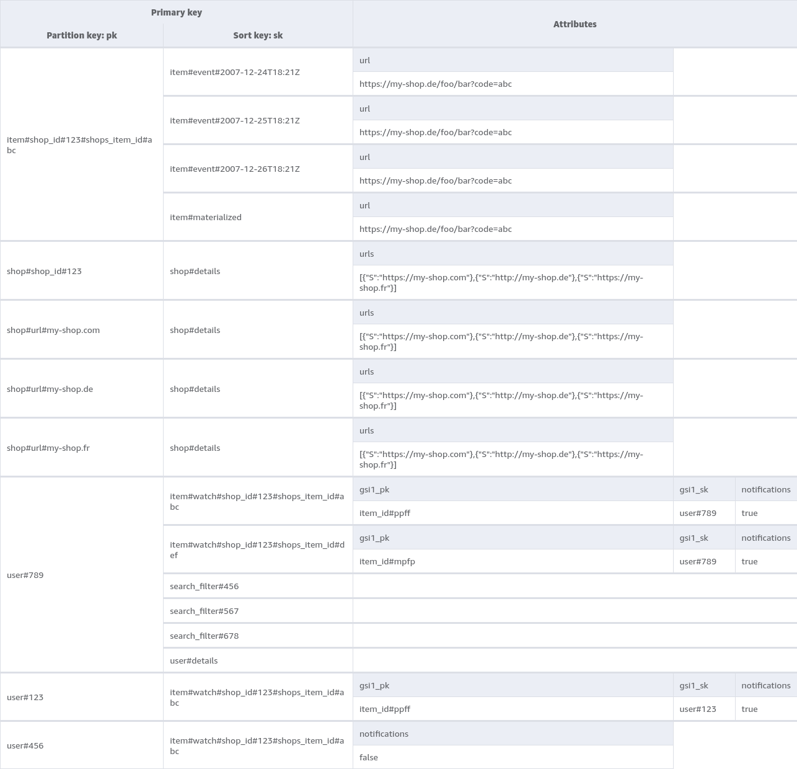
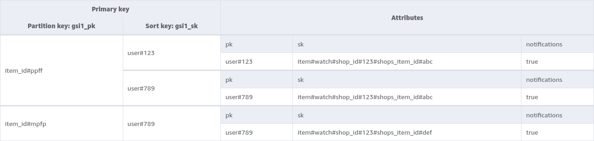

# High-Level DynamoDB Structural Overview

- Single-Table-Design

## Primary Table `table_1`

### Entities

#### Item

- PK is composite of `ShopId` and `ShopsProductId`
- Primary event-store - via timestamp in SK
- Contains a materialized view with extra SK

#### Shop

- Multi-Partition per actual shop
  - PK is either:
    - the `ShopId`
    - any of the shops domains
  - SK is constant `details`
  - Partitions must be kept strictly in sync (`TransactWriteItems`) 

#### User

- PK is `UserId` (Cognito-Sub)
- SK
  - Composite of `ShopId` and `ShopsProductId` for products on users watchlist
  - `SearchFilterId` for saved search-filters
  - Constant `details` for user-data (Cognito only acts as IDP)

## Local Secondary Indexes

### LSI1: `lsi1`

- Sparse (globally)
- SK is `lsi_sk`
- User
  - Uses it for sorting by creation-timestamp of watchlist-entries 
  - Sets SK as that exact timestamp  

## Global Secondary Indexes

### GSI1: `gsi1`

- Sparse (globally)
- PK is `gsi1_pk`
- SK is `gsi1_sk`
- User
  - PK is `ProductId` 
  - SK is `UserId` 
  - Uses it to query all users that have notifications for a product on their watchlist activated
  - SK is sparse locally - it's only set if a product is on the users watchlist **and** notifications are activated
  - This invariant must always hold - crucial for inserts/updates of watchlist-products

