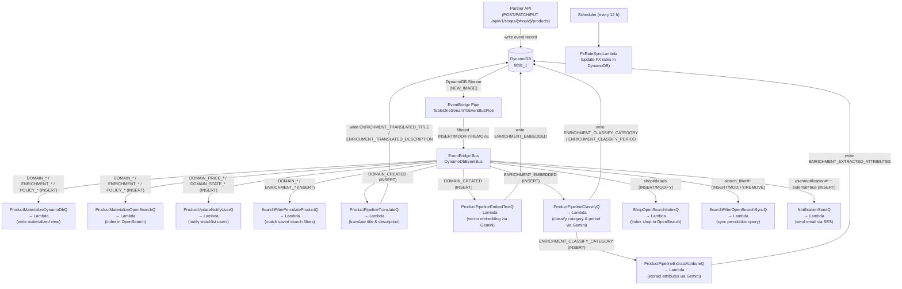
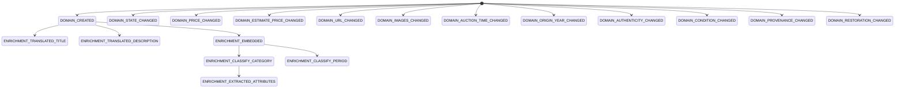

# Event Flow

All events originate from DynamoDB Stream changes on `table_1`. An EventBridge Pipe
(`TableOneStreamToEventBusPipe`) filters relevant stream records and forwards them to the
`DynamoDbEventBus`. EventBridge rules on that bus fan out to dedicated SQS queues, each
consumed by a Lambda function.

---

## Components

| Component | Type | Purpose |
|-----------|------|---------|
| `table_1` | DynamoDB Table | Single event-store and read-model table |
| `DynamoDbEventBus` | EventBridge Bus | Central routing bus for all DynamoDB stream events |
| `TableOneStreamToEventBusPipe` | EventBridge Pipe | Filters DynamoDB stream records and publishes to the event bus |
| `ProductMaterializeDynamoDbQ` | SQS + Lambda | Writes materialized product view to DynamoDB |
| `ProductMaterializeOpenSearchQ` | SQS + Lambda | Indexes products in OpenSearch |
| `ProductUpdateNotifyUserQ` | SQS + Lambda | Notifies watchlist users on price/state changes |
| `SearchFilterPercolateProductQ` | SQS + Lambda | Matches products against saved search filters, notifies users |
| `ProductPipelineTranslateQ` | SQS + Lambda | Translates product titles and descriptions (ML, GPU) |
| `ProductPipelineEmbedTextQ` | SQS + Lambda | Creates vector embeddings via Gemini Embedding API |
| `ProductPipelineExtractAttributeQ` | SQS + Lambda | Extracts product attributes (year, condition, …) via Gemini |
| `ProductPipelineClassifyQ` | SQS + Lambda | Classifies products into categories and periods via Gemini |
| `ShopOpenSearchIndexQ` | SQS + Lambda | Indexes shop records in OpenSearch |
| `SearchFilterOpenSearchSyncQ` | SQS + Lambda | Syncs search filters to OpenSearch percolation queries |
| `NotificationSendQ` | SQS + Lambda | Sends external notifications via SES |
| `FxRateSyncLambda` | Lambda (scheduled) | Updates foreign exchange rates (every 12 h) |

---

## Event Routing Diagram

---

## Event-Chain State Diagram

The diagram below shows which product event types cause new event types to be written back to
`table_1` by the enrichment pipeline. `[*]` is the Mermaid notation for the initial state;
events starting from `[*]` are written purely by the external API and have no preceding product
event.

---

## Stream Filter Details

The EventBridge Pipe applies the following DynamoDB Filter Criteria before publishing to the bus:

| Filter | `pk` pattern | `sk` pattern | Operation |
|--------|-------------|-------------|-----------|
| Product events | `product#shop_id#*` | `product#event#*` | INSERT |
| User details | `user#*` | `user#details` | MODIFY |
| Shop details | `shop#shop_id#*` | `shop#details` | INSERT, MODIFY |
| User notifications | `user#*` | `user#notification#origin_event_id#*` | INSERT |
| Search filters | `user#*` | `search_filter#*` | INSERT, MODIFY, REMOVE |

---

## Dead Letter Queues

Every SQS queue has a corresponding DLQ. Retry limits:

| Queue | Max Retries |
|-------|-------------|
| Materialization queues | 5 |
| Notification queues | 5 |
| Pipeline queues | 3 |
