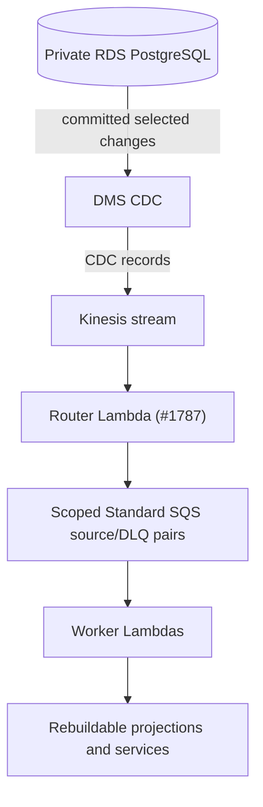

# Event Flow

The post-legacy-source target is PostgreSQL → DMS → Kinesis → router Lambda → scoped Standard SQS → worker Lambdas. This describes the intended source after native/Sequin worker code removal, **not** evidence of a live cutover: DMS start, router and queue mappings, external Sequin decommissioning, and backlog settlement require separate operator approval and proof. See [architecture §12](../arch.md#12-cdc-and-projection-architecture), [Migration F7](../migration-f7-dms.md), and the [durable-worker runbook](../durable-worker-runbook.md).

## Components

| Component | Type | Purpose |
|---|---|---|
| Postgres | Database | Business source of truth and transactional ProductListing/event writes. |
| `product_listing_events` | Postgres table | ProductListing domain/enrichment event journal and CDC source. |
| `auction_events` | Postgres table | Auction discovery/change journal, atomically persisted with accepted facts; no projection/worker consumer yet. A future Auction-schedule notifier must use payload snapshots and never manufacture member ProductListing changes. |
| `product_listing_raw_revisions` | Postgres table | Immutable raw ProductListing source evidence; CDC wake-up source for authoritative normalization only. |
| `notification_deliveries` | Postgres table | Durable email-delivery intent and lease state. |
| DMS / Kinesis | CDC / stream | CDC-only capture of selected committed PostgreSQL rows into the retained stream, subject to approved start. |
| `cdc-router-lambda` | AWS Lambda | Validates DMS Kinesis records and confirms all scoped SQS fanout before a Kinesis checkpoint. |
| Scoped Standard SQS source/DLQ pairs | Durable transport | One pair per scope; all ten scoped consumers have independently gated dedicated Lambda mappings; source7d/DLQ14d retention and duplicate/reordered delivery apply. |
| OpenSearch | Search projection | Rebuildable ProductListing and search-filter projection. |
| FxRate Lambda | AWS Lambda | Captures immutable canonical EUR-base FX snapshots in Postgres. |
| `aura-historia-cron` | Rust process | UTC scheduled triggers for service-owned use cases. |
| Shopify Lambda | AWS Lambda | Captures changed Shopify raw ProductListing revisions; canonical normalization is asynchronous. |
| Stripe Lambda | AWS Lambda | Handles Stripe subscription events, writes Postgres directly. |
| CloudWatch log-retention Lambda | AWS Lambda | Keeps AWS log retention policy. |

## DMS/Kinesis routing (target; live cutover unverified)

This is the agreed source after explicit CDC start and AWS evidence gates, not a claim of live delivery. Historically Sequin delivered to the native `aura-historia-worker`, which fanned out to these queues and also polled them. Removing that source code neither drains nor disables external subscriptions; do not assume their live decommissioning. DMS is CDC-only: no outbox, custom CDC transport, or downstream target redesign.



### Target Kinesis router checkpoint and recovery contract

The real-stage `cdc-router-lambda` is outside the customer VPC and has no database credentials. It accepts only a native Kinesis envelope with a usable sequence number and strict DMS data (`{ data, metadata }`) or control (`{ control, metadata }`) record, then validates the entire single-record route, all destinations, and schema-2 encoded compact jobs before publishing. Source data is base64-decoded only in memory and never logged or embedded in SQS jobs.

The immutable router Lambda version mapping is independently disabled by default through `CdcRouterEnabled`, starts at `TRIM_HORIZON`, batches at most 100 records for one second, reports partial batch failures, bisects invocation errors, allows three retries, and stops a record after one hour. The handler returns only the earliest unconfirmed **Kinesis sequence number** and stops; later records are not reported as success. Valid non-trigger table operations and selected informational controls acknowledge with no job. Malformed rows, incompatible schema controls, unsupported Kinesis shapes, expired invocation budget, missing/unknown SQS confirmation, and partial fanout remain failed.

After that retry/age policy, Lambda sends the complete failed Kinesis invocation to the retained private S3 failure archive, not a worker SQS DLQ. The archive preserves the original envelope for controlled replay and expires after 90 days; worker source queues retain jobs for seven days and their paired DLQs for 14 days. These are distinct custody boundaries. R6 selects `product_listing_raw_revisions`, `search_filters`, `search_filter_matches`, and `notification_deliveries` alongside the journal, while retaining the explicit per-table application-trigger policy below. See [Migration F7](../migration-f7-dms.md) for activation, capture-evidence, replay, privacy, and operator requirements. Live DMS proof remains an approved operator gate, not a checked-in fixture claim.

## ProductListing write flow

Partner ProductListing API writes are synchronous and bypass raw capture. Crawler, Shopify, and WooCommerce are raw-only producers: each maps provider/source fields into generic `raw_values`, preserves its semantic source object, and captures an immutable changed raw revision. The crawler captures a generic product extraction or verified removal; Shopify maps status/inventory before capture; WooCommerce verifies untouched signed bytes before parsing and maps topic/status/stock before capture. Signatures, headers, wire bytes, and raw JSON never enter logs or queues. Raw revisions independently retain optional `source_event_id` and provenance after receipt expiry. Provider receipt rows are created or reused only for observations that map to raw capture; they store only a canonical source-evidence digest, never source evidence or JSON, and logically expire after 90 days; bounded PostgreSQL cleanup may reclaim physical rows later. An authorized ignored WooCommerce create/update status event returns before receipt construction and persists no receipt or receipt-based idempotency state, even when it supplies a delivery ID. No delivery identity or source timestamp is required for accepted intake. `Changed`, `Unchanged`, ignored, deduplicated, and stale outcomes acknowledge intake; WooCommerce `204` covers all of them, not canonical completion. The `product-listing-normalization` Lambda is the sole raw-to-canonical authority; CDC wake-ups are durably held in SQS and it drains authoritative PostgreSQL progress in bounded attempts with ordinary retry/redrive. There is no scheduled raw reconciliation in this target. PostgreSQL `product_listings` remains authoritative; `product_listing_events` is its transactional domain journal and target DMS CDC source, not an outbox. One logical domain write produces zero or one event: initial state is `PRODUCT_LISTING_DISCOVERED`; later semantic mutations are one non-empty `PRODUCT_LISTING_CHANGED` object. Discovery carries immutable `listing_source_id` and `source_listing_id`, initial facts, and image count only. Changed carries separate main-price, estimate, availability, URL, image-count, listing-owned Auction/lot facts, lifecycle, and sale-observation dimensions. Listing Auction facts contain an optional same-source Auction ID, lot label, catalogue position, and independent optional RFC3339 opening, scheduled-close, and reported-close instants; no context-presence assertion or precision/timezone wrapper exists. Partner writes validate supplied `auctionId` against an existing same-source Auction. Raw normalization uses a ProductListing-only canonical write: it preserves stored Auction membership and lot facts, and never creates or mutates Auction data. Raw completion has no Auction evidence, acceptance receipt, or Auction-specific diagnostic. Sale observation is encoded as `None -> Some` for observation and `Some -> None` for retraction; correction from one observation to another is rejected. Payloads never contain image URLs or a redundant `kind`. Generic create, update, and upsert never capture FX or infer a sale observation from `SoldOut`.

```mermaid
sequenceDiagram
    participant Caller
    participant API as aura-historia-api or AWS intake Lambda
    participant PG as Postgres
    participant DMS as DMS
    participant Stream as Kinesis
    participant Router as cdc-router-lambda
    participant Queue as Scoped Standard SQS
    participant OS as OpenSearch

    Caller->>API: ProductListing create/update/withdraw
    API->>PG: begin transaction
    API->>PG: lock/read ProductListing row
    API->>PG: insert/update authoritative product_listings state
    API->>PG: insert product_listing_events
    API->>PG: commit
    API-->>Caller: success/failure after commit
    PG-->>DMS: selected committed change after approved start
    DMS->>Stream: CDC record
    Stream->>Router: Kinesis batch
    Router->>Router: validate complete record route and destinations
    Router->>Queue: publish all required scoped jobs
    Queue-->>Router: confirmed publication
    Router-->>Stream: Lambda mapping checkpoints after confirmed fanout
    Queue->>OS: worker Lambda applies versioned projection
    Note over Router,Queue: Failed Kinesis sequences retry/archive; failed SQS jobs retry/DLQ
```

No intermediate ProductListing command SQS queue. No `202 accepted because queued` behavior for migrated writes.

## Router fanout and custody

The Kinesis router validates each complete DMS record and its scoped destinations before sending any job. ProductListing v1 group/type/payload pairs, typed IDs, domain-first keys and compact schema-2 job serialization remain strict; unknown additive SQS job fields are tolerated, but schema 1 and malformed required fields fail. A valid selected non-trigger operation produces no job. Partial fanout or lost SQS confirmation leaves the earliest Kinesis sequence uncheckpointed; retry may duplicate confirmed jobs. After bounded Kinesis retries/age, the original failed invocation goes to the private S3 archive, **not** a worker DLQ. Confirmed jobs then have seven-day source SQS retention and 14-day DLQ retention; Standard redrive retains the original enqueue age. Only complete Lambda handling acknowledges an SQS record. This is retention-bounded at-least-once, never exactly-once or ordered delivery. There is no user-tier queue, worker inbox, or processed-job table.

Historically the Sequin HTTP ingress required full-batch prevalidation and returned `202` only after all scoped SQS sends were confirmed (8s publication deadline, 10s request deadline). Its source removal is not proof that old externally owned subscriptions stopped or that previously in-memory jobs were recovered. The old native normalizer's periodic backlog scan is **not** a target Lambda scheduler, activation gate, or fallback. See the [runbook](../durable-worker-runbook.md) for handoff and recovery.

## CDC routing

| Source table | Operation | Route |
|---|---|---|
| `product_listing_events` | INSERT | `DOMAIN`/`PRODUCT_LISTING_DISCOVERED` v1 routes to projector, percolator, content assessment, embedding, and translation. `DOMAIN`/`PRODUCT_LISTING_CHANGED` v1 routes to projector and percolator; main-price or availability dimensions also route watchlist, and an `images` dimension also routes embedding. `ENRICHMENT`/`ENRICHMENT_EMBEDDED` v1 and `ENRICHMENT`/`ENRICHMENT_TRANSLATED_TITLES` v1 route to projector and percolator. Image, price, and availability dimensions fan out independently, so a combined payload routes to the union. Embedded does not route translation. Lifecycle is a changed-event dimension, not an event group. |
| `product_listing_raw_revisions` | INSERT | `product-listing-normalization` only. Compact raw stream/revision IDs and revision number; never source JSON. The dedicated SQS Lambda drains the PostgreSQL stream head in order and atomically writes terminal raw progress with zero or one canonical state/event. Candidate-data failures are terminal `REJECTED`; configuration/persistence failures leave progress pending. Only a fully drained stream is acknowledged; capped direct drains and all unfinished failures return `batchItemFailures` for ordinary retry/redrive. No direct projection, notification, enrichment, assessment or matching route. |
| `product_listings` | INSERT/MODIFY/DELETE | Not a selected DMS source. ProductListing events are the projection trigger to avoid double-firing. |
| `search_filters` | INSERT/MODIFY/DELETE | Search-filter OpenSearch sync for every persisted change; handlers reread the complete authoritative record. Idempotency: `(user_search_filter_id, version, op)`. |
| `search_filter_matches` | INSERT | Search-filter match notification worker. It rereads the exact persisted match and ProductListing source, then inserts one PostgreSQL SearchFilter notification for that matching filter. Idempotency: `(user_id, user_search_filter_id, product_listing_id, origin_event_id)`. |
| `notification_deliveries` | INSERT | Notification-delivery worker. It validates initial `EMAIL`/`PENDING` shape, claims the durable delivery lease with joined source in PostgreSQL, sends through S3 templates and SES, then finalizes that lease. Idempotency and ordering: `notification-delivery:{delivery_id}`. Active claims defer, never complete; a send/finalize crash can still duplicate email. |
| `users` | MODIFY | Not a selected DMS source or worker scope; do not route to these SQS queues. |
| `product_listing_watchlist` | INSERT/MODIFY/DELETE | Not a selected DMS source; ProductListing events drive notifications. |
| `partnership_applications` | INSERT/MODIFY | Not a selected DMS source. Decision writes create canonical notification delivery intents in the same PostgreSQL transaction. |

## Domain jobs

Worker sub-jobs use domain payloads or compact IDs and should not depend on raw CDC transport JSON outside the router.

Target SQS payloads are `ProductListingEventJob`, `ProductListingRawRevisionJob`, `SearchFilterChangedJob`, `SearchFilterMatchCreatedJob`, and `NotificationDeliveryCreatedJob`. They contain compact typed identifiers/revisions, not source evidence. Handlers read authoritative source through service ports. SQS message IDs, receipts and redrive timestamps are not business identity.

## Consumers and scheduled matching

| Sub-worker | Runtime | Input | Side effects |
|---|---|---|---|
| ProductListing OpenSearch projector | dedicated SQS Lambda | ProductListing event job | Writes a full active document or content-free, external-versioned withdrawal tombstone. |
| Watchlist notification generator | dedicated SQS Lambda | Price/availability ProductListing event job | Locks current ProductListing lifecycle through PostgreSQL notification and delivery-intent commit; inserts one row per semantic reason. |
| Notification delivery dispatcher | dedicated SQS Lambda | `notification_deliveries` insert job | Claims PostgreSQL delivery lease, dispatches by persisted channel, and finalizes durable delivery state. EMAIL resolves its current target, renders S3 templates, and sends through SES. |
| Search-filter percolator | dedicated SQS Lambda | Domain/enrichment ProductListing event job | Postgres matches only. |
| Search-filter match notification generator | dedicated SQS Lambda | Search-filter match inserted job | One PostgreSQL SearchFilter notification per matching filter. |
| ProductListing content assessment | dedicated SQS Lambda | ProductListing event job | Reads current listing text and writes a content-source-revision guarded assessment row. It emits no ProductListing event and never writes OpenSearch. |
| ProductListing embed | dedicated SQS Lambda | `PRODUCT_LISTING_DISCOVERED` or changed job with `images` | Postgres enrichment event + ProductListing update. Embedding stored in Postgres only. |
| ProductListing translate | dedicated SQS Lambda | `PRODUCT_LISTING_DISCOVERED` job | Postgres `product_listing_translations` upsert plus one translated-titles enrichment event and ProductListing revision update; first committed completion wins for each content source event. |
| Search-filter OpenSearch sync | dedicated SQS Lambda | Search-filter changed job | OpenSearch percolator document write/tombstone from complete Postgres state, with external source-version protection. Search-filter embedding stays in Postgres. |
| ProductListing normalization | dedicated SQS Lambda | Raw revision job | Atomic canonical state/event and persisted raw progress; only clean drains acknowledge, capped drains retry, and no Lambda-local continuation state is required. |
| Periodic matcher | `aura-historia-cron` | UTC schedule | Runs `RunPeriodicSearchFilterMatching`; it writes only idempotent `search_filter_matches`. CDC remains the sole notification trigger. |

`product-listing-opensearch-lambda`, `product-listing-normalization-lambda`, `product-content-assessment-lambda`, `product-embedding-lambda`, `product-translation-lambda`, `search-filter-projection-lambda`, `search-filter-percolator-lambda`, `search-filter-match-notification-lambda`, `watchlist-notification-lambda`, and `notification-delivery-lambda` consume only their respective queues after independent explicit activation. Periodic matching stays in `aura-historia-cron`, not another queue scope.

### ProductListing SQS Lambda activation

The source/DLQ pair, Lambda mapping, and function version are retained while the mapping is off. Protected `Initialize (CD)` initializes schema and captures initial FX with event consumers disabled; it declares but never starts DMS. A separately approved CDC start must use the actual source slot/LSN and confirm router fanout before activating consumers. Do not infer that source removal settled native in-flight work: pause old consumers and settle/preserve their backlog before any live handoff. Never run two consumers of one queue during handoff. Ordinary `Deploy (CD)` preserves approved mapping state. Do not rename, replace, or purge the queues; retained jobs use ordinary SQS retry/DLQ. No native-process rollback remains after source removal; any rollback requires a separately approved compatible artifact and explicit fencing.

## Canonical ProductListing OpenSearch projection

PostgreSQL `product_listings`, `product_listing_translations`, and immutable `fx_rates` are authoritative. The `product-listings` OpenSearch index is rebuildable only. Each committed `product_listing_events` insert creates one ProductListing projection job with stable `(event_id, product_listing_id)` IDs. The handler rereads complete current ProductListing state and rejects a trigger whose event ID is no longer current. It loads the exact observation FX snapshot only for an active `SoldOut` listing with both an observation and a monetary main source price, commits its PostgreSQL read transaction, then writes the complete private document with `product_listings.projection_version` as OpenSearch external version.

Current `Withdrawn` state replaces the full document with content-free `{productListingId, projectionDeleted: true}` at that external version. Raw OpenSearch GET returns 200 with this marker, not 404. All product search, hybrid BM25/KNN and similar-listing readers exclude true before pagination/ranking; absent markers remain live. Current `Active` state, including restore, writes a full document only at a newer source version. Live documents have optional `availability` but no lifecycle field. Duplicate/older writes and stale withdrawals after restore are stale no-ops. Missing required observation FX fails for retry.

This fence survives physical-delete `index.gc_deletes`; never TTL or physically delete tombstones. Deploy mappings and all readers before writers, fence old physical-DELETE writers including in-flight requests, and use the [fenced rebuild procedure](../durable-worker-runbook.md#projection-fences-and-rebuild), not index reset. Withdrawn source rows support backfill; absent historical deletion facts do not.

The document stores native tagged `sourcePrice` (`MONETARY` or `ON_REQUEST`), immutable HalfUp `salePrices` only when a qualifying observation has a monetary source price, and `saleObservationFxRateId` / `saleObservedAt` independently. A sold no-main-price document has observation metadata but no `sourcePrice` or `salePrices`; an on-request document retains `sourcePrice: ON_REQUEST` with no `salePrices`. Both remain searchable by non-price criteria; on-request maps to an on-request display price. All existing search fields and the authoritative embedding remain. It never stores estimates. ProductListing search cursor chains and similar-listing KNN reads pin one persisted snapshot for active summary conversion; sold summaries use indexed immutable sale amounts when present and preserve the valuation basis. The dedicated Lambda needs `POSTGRES_*`, `STAGE`, `OPENSEARCH_ENDPOINT_URL`, and OpenSearch credentials outside `ephemeral`. It processes one record per invocation; only applied/deleted/stale service outcomes acknowledge. Retry, poison, timeout, panic, cancellation, and acceptance-unknown results are `batchItemFailures` for the source queue's native retry/DLQ. No Lambda receipt loop, visibility adjustment, HTTP CDC ingress, or health server participates in this scope.

## Canonical ProductListing content assessment

`product-content-assessment-lambda` uses a retained, default-disabled native Lambda SQS mapping after `ProductContentAssessmentConsumerEnabled=true` is approved. It processes one record with `ReportBatchItemFailures`, a 45-second invocation cap, and 270-second source visibility (`6 × 45s`); ordinary SQS redrive still occurs after five receives. It has only `POSTGRES_*` and source-queue consume permissions. Committed assessment, duplicate, and stale outcomes acknowledge; missing source, malformed job, PostgreSQL failure, timeout, panic, and ambiguous commit remain failed for native retry/DLQ. It emits no ProductListing event and never writes OpenSearch.

## Canonical ProductListing embedding

The product-embedding scope accepts only `product_listing_events` inserts and enqueues `PRODUCT_LISTING_DISCOVERED` plus `PRODUCT_LISTING_CHANGED` events whose validated payload has the `images` dimension. Its service use case accepts only those semantic sources and requires `product_listings.embedding_source_event_id` to equal the trigger event ID. It supplies the title, optional description, and first image URL to neutral `embedding` before opening a short PostgreSQL transaction. The configured embedding adapter owns provider-specific prompt format. An image change advances that marker and clears the stored vector atomically. The writer locks and rechecks the marker, stores the normalized 768-float vector, appends compact `ENRICHMENT_EMBEDDED` provenance containing only `sourceEventId`, and advances `product_listings.current_event_id` plus projection version. Exact redelivery is target-side duplicate detection by source event, so the first committed vector wins; only a superseding embedding source is stale.

`product-embedding-lambda` uses a retained, default-disabled native Lambda SQS mapping after `ProductEmbeddingConsumerEnabled=true` is approved. It processes one record with `ReportBatchItemFailures`, a 60-second invocation cap, and 360-second source visibility (`6 × 60s`). It requires only `POSTGRES_*`, `VERTEX_AI_PROJECT_ID`, `VERTEX_AI_LOCATION`, Google ADC, and source-queue consume permissions; it has no OpenSearch, SES, template, or direct SQS-publish access. The runtime materializes ADC privately under `/tmp`; its access-token credentials refresh for warm invocations and neither credentials, source text/images, vectors, nor provider responses are logged. Applied, duplicate, stale, ignored, and authoritative missing-title outcomes acknowledge. Missing source, provider or PostgreSQL failure, timeout, panic, malformed job, and ambiguous commit remain failed for native retry/DLQ. The service reads source data before provider inference and opens the one-connection PostgreSQL transaction only for guarded persistence. It emits the existing PostgreSQL enrichment event; CDC, rather than a dual write, triggers downstream projection. Per-invocation records include aggregate message, duration, guard-rejection, and retry counts only. The shared DMS task selects `product_listing_events`; the Kinesis router routes only eligible inserts to the embedding queue, without a per-Lambda subscription. Historically the Sequin subscription was limited to event inserts; externally owned subscriptions must be retired explicitly. Provider calls happen before the write transaction; failures create no partial Product state.

## Canonical ProductListing translation

The product-translation scope accepts only `product_listing_events` inserts and enqueues only `PRODUCT_LISTING_DISCOVERED`; `ENRICHMENT_EMBEDDED` has no translation route. Its service use case rereads the committed source and requires `product_listings.content_source_event_id` to equal the trigger event ID before invoking the configured neutral `large-language-model` translator. It translates a non-empty native title into the supported target languages other than the source language, then opens a short PostgreSQL transaction. The writer locks the ProductListing, detects an existing valid translated-titles completion by source event before stale comparison, rechecks the content-source marker for new work, upserts provenance-bearing `product_listing_translations`, appends one compact translated-titles enrichment event with source language and target-language codes only, and advances `product_listings.current_event_id` plus projection version. Redelivery is target-side idempotent: the first committed completion wins regardless of later LLM text; only a never-completed superseded content source is stale.

`product-translation-lambda` consumes only its retained source queue after `ProductTranslationConsumerEnabled=true` is approved. It uses batch size one, `ReportBatchItemFailures`, a 45-second invocation cap, and 300-second source visibility. It requires only `POSTGRES_*`, `VERTEX_AI_PROJECT_ID`, `VERTEX_AI_LOCATION`, `VERTEX_AI_MODEL`, and Google ADC; the runtime materializes ADC privately under `/tmp`, refreshes credentials after warm idle, and logs no credentials, titles, prompts, or provider payloads. Applied, duplicate, stale, ignored, and authoritative missing/empty-title/language outcomes acknowledge. Missing committed source, malformed job, provider or PostgreSQL failure, timeout, panic, and ambiguous commit remain failed for native retry/DLQ. It emits only the existing PostgreSQL enrichment event; CDC triggers downstream projection without a direct queue send or translation loop. The source read and inference occur before the short one-connection guarded write transaction. Before activation, verify old consumption has stopped and in-flight work has settled; any rollback needs an approved compatible artifact and a disabled mapping before another consumer starts.

## Canonical search-filter percolator

The percolator scope accepts only `product_listing_events` inserts. It enqueues only `DOMAIN` and `ENRICHMENT` ProductListing events, parsing typed event and ProductListing IDs once at CDC ingress, rereads the committed typed ProductListing match source including immutable `product_listing_events.event_time`, and invokes `MatchProductListingEventUseCase`. The use case compares the source event ID with `product_listings.current_event_id` before percolating; a superseded trigger is skipped, never evaluated against newer ProductListing state with its old origin ID. A current withdrawn listing is an explicit inactive-source skip: it performs no percolation, evaluation, or match write. For an accepted active current event with a monetary main source price, it uses the immutable sale snapshot when present; otherwise it reads latest persisted FX with `captured_at <= origin_event_time`, ordered by capture then generation. It converts that monetary price into every supported currency only in the private temporary percolation document. On-request and absent prices omit numeric percolation fields. Stored filter queries remain FX-independent. Current active events percolate the canonical OpenSearch filter projection, then batch enhanced candidates through the neutral typed `large-language-model` capability. The service owns the product-match prompt, structured response schema, typed response mapping, retry policy, and first-five-product-image policy; the capability owns Vertex protocol, credentials, image fetch, generic output deserialization, and its configured provider model. The worker selects that model through required `VERTEX_AI_MODEL` configuration, not use-case code. The final short PostgreSQL transaction locks/rechecks the ProductListing current event, then batch-locks active filters through match commit. Candidates must still have the exact evaluated semantic search plus embedding; changed inputs/deactivation/deletion suppress them, but unrelated name/notification edits remain eligible. It stores eligible idempotent plain or successful-enhanced matches. An enhanced candidate failure never prevents those writes: retryable timeout, transport, 429, 5xx, and malformed-response failures return after commit for normal worker retry; permanent provider 4xx failures are explicit in the use-case result and never create a match. Vertex requests use a 10-second connect and 30-second total timeout, bounded concurrency, at most five product-image fetches per evaluation request, structured JSON, and reasons in the filter search language.

`search-filter-percolator-lambda` consumes only the `search-filter-percolator` Standard SQS queue after `SearchFilterPercolatorConsumerEnabled=true` is approved. It uses native Lambda SQS delivery with batch size one and `ReportBatchItemFailures`; no receipt loop, native polling, health server, shutdown controller, SES client, or direct notification publication participates. It requires only `POSTGRES_*`, `STAGE`, OpenSearch endpoint/credentials, Vertex project/location/model, and Google ADC; the runtime materializes ADC privately under `/tmp` and never logs it. Unsupported ProductListing event group/type/version pairs and malformed routing payloads reject before fanout; supported events irrelevant to this scope produce zero jobs and acknowledge normally. ProductListing-event redelivery is safe through the match uniqueness key; price matches retain `EVENT` or `SALE_OBSERVATION` snapshot provenance, while non-price matches retain null valuation provenance. Processed, duplicate, stale, inactive-source, missing-source, and ignored-event outcomes are recorded separately. Missing source, provider/transaction failure, timeout, panic, and ambiguous commit remain failed for native SQS retry/DLQ; only committed service outcomes acknowledge. FX capture has no percolation, ProductListing projection, match, or notification route. See [durable-worker operations](../durable-worker-runbook.md#failure-custody-and-controlled-redrive) for queue retry and recovery limits.

## Search-filter match notification generator

The match-notification scope accepts only `search_filter_matches` inserts. Its job and source read use `(user_id, user_search_filter_id, product_listing_id, origin_event_id)`, so a stale or superseded CDC row cannot notify a different match. It reads the committed Product source and invokes `GenerateSearchFilterMatchNotificationUseCase` for every persisted matching filter. The transaction-scoped ProductListing source uses a `FOR SHARE` row lock through notification and delivery-intent commit; it does not compare the historical origin event with `current_event_id`. A mismatched match is terminal stale suppression, while a missing committed match or ProductListing source remains retryable for native SQS retry/DLQ. The use case locks the user tier and calculates the event's stable monthly notification rank; this gates delivery eligibility only, never match persistence. PostgreSQL inserts the notification and optional external-delivery rows atomically. Exact CDC redelivery and concurrent filters are protected by the SearchFilter semantic identity, so each matching filter remains distinct.

`search-filter-match-notification-lambda` uses native Lambda SQS delivery after `SearchFilterMatchNotificationConsumerEnabled=true`, with batch size one, `ReportBatchItemFailures`, a 45-second invocation limit, and 300-second source visibility. It has only `POSTGRES_*` configuration and source-queue receive/delete/visibility permissions: no OpenSearch, SES, template, or direct publish access. Applied, duplicate, quota, deleted-user, stale, and withdrawn results acknowledge; missing committed sources, dependency failures, malformed records, timeout, panic, and unknown commit remain failed for retry/DLQ. The shared DMS task also captures `search_filter_matches` non-trigger changes, which the Kinesis router acknowledges without a notification job; only inserts reach this queue. The former Sequin insert-only subscription must be decommissioned separately in the live environment.

Enhanced search filters use the canonical Vertex AI Gemini implementation of the neutral typed `large-language-model` capability. Timeout, transport, 429, 5xx, and malformed-response failures are retryable worker failures after plain/successful matches commit. Other provider 4xx failures are permanent candidate failures. The worker never treats an enhanced filter as matched or silently bypasses evaluation.

## Canonical watchlist notification generator

The watchlist worker scope accepts only `product_listing_events` inserts and enqueues canonical price/availability events. The ProductListing service reads the immutable source and uses persisted `product_listing_events.event_time` as the eligibility timestamp. `product_listing_watchlist.active_since` is the beginning of the current active interval; `notifications_enabled_since` is the beginning of the current email-enabled interval.

At processing time, a recipient must still have `state = ACTIVE` and `active_since <= product_listing_events.event_time`. Email delivery additionally requires `notifications = true` and `notifications_enabled_since <= product_listing_events.event_time`. Thus late activation and late email enablement do not receive older events; a late email enablement can still receive the in-app notification. Deactivation and reactivation start a new active interval, and disabling and re-enabling email starts a new email interval. The current state is authoritative, so an entry inactive when processed receives neither channel.

Before writing, the use case reads the exact ProductListing event and uses its immutable event time for recipient eligibility. A later unrelated `current_event_id` does not suppress this historical fact. The source query locks the current ProductListing row with `FOR SHARE`; that lock remains held while recipients, notifications, and delivery intents are written through commit. The current listing must still be `ACTIVE`; a withdrawn listing is explicitly suppressed to avoid creating a snapshot for a hidden listing. Changed events without main-price or availability changes are acknowledged as ignored; a missing committed source remains retryable for native SQS retry/DLQ. Worker logs distinguish applied work, duplicates, ignored events, missing sources, and withdrawn suppression.

Watchlist semantic identity is `(user_id, origin_event_id, kind)`, so a price change and availability change remain distinct. Recipients with email disabled or email enabled after the event receive the in-app notification without a `notification_deliveries` row.

Duplicate webhook delivery is safe through the PostgreSQL semantic unique index. No currency conversion is invented: price-change payloads carry only each stored source price; rendering localizes from current user preferences.

`watchlist-notification-lambda` uses native Lambda SQS delivery after `WatchlistNotificationConsumerEnabled=true`, with batch size one, `ReportBatchItemFailures`, a 45-second invocation limit, and 300-second source visibility. It has only `POSTGRES_*` configuration and source-queue receive/delete/visibility permissions: no OpenSearch, SES, template, or direct publish access. Applied, duplicate, ignored, and withdrawn results acknowledge; missing committed sources, dependency failures, malformed records, timeout, panic, and unknown commit remain failed for retry/DLQ. In the shared DMS task, the Kinesis router sends only eligible ProductListing event inserts to the watchlist queue and saved-filter changes to the projection queue. Former scope-specific Sequin subscriptions are not part of this target.

## Canonical notification delivery

The `notification-delivery` scope accepts only `notification_deliveries` inserts and publishes schema-2 SQS jobs carrying the `nd_` TypeID `notification_delivery_id`; idempotency/ordering is `notification-delivery:{delivery_id}`. Deliveries are unique per `(notification_id, channel, target_key)`. The service atomically claims a five-minute PostgreSQL lease and loads source, commits before channel I/O, then dispatches once within a four-minute total budget. EMAIL alone resolves current `PRIMARY`, renders S3 templates and calls SES with SDK max attempts 1.

Active claims defer until persisted expiry +5s; reclaimable `PENDING`/expired-claim races defer 1s. Neither acknowledges. Current runtime retries missing delivery rows too. Known transient rejection/pre-send failures finalize back to `PENDING`; permanent/source failures require confirmed `FAILED` finalization. Ambiguous SES timeout/transport/unknown/5xx/missing-receipt outcomes keep the lease, give no acknowledgment and never resend inside the attempt.

Retry only finalization with the original lease token, completion time and provider receipt/error tuple. The initial business schema stores `completed_lease_token`/`completed_at`, so an exact persisted completion can confirm a lost response without another write/send. Only confirmed terminal outcomes permit SQS deletion; lease loss/unconfirmed finalization remains retryable. A crash after SES acceptance can still cause duplicate email after reclaim. See [notification recovery](../durable-worker-runbook.md#notification-recovery-limits).

`notification-delivery-lambda` consumes only the retained `notification-delivery` source queue after `NotificationDeliveryConsumerEnabled=true` is approved. It has a 45s invocation cap, batch size one, `ReportBatchItemFailures`, a 35s service attempt budget, and 330s source visibility: a five-minute PostgreSQL lease plus a 30s recovery margin. It never extends visibility or treats an active/deferred lease as completion, so a duplicate claim remains hidden until a later normal SQS receive instead of repeatedly consuming receives. Only durable terminal outcomes (`Delivered`, `AlreadyDelivered`, finalized permanent failure, or finalized `SourceMissing`) acknowledge; missing/unfinalized deliveries, claim deferrals, lost leases, invocation timeout/panic, provider-acceptance ambiguity, and unconfirmed/exhausted finalization stay in `batchItemFailures` for normal SQS retry/DLQ. It requires only `POSTGRES_*`, `S3_BUCKET_NAME_TEMPLATES`, `NOTIFICATION_EMAIL_FROM`, `NOTIFICATION_EMAIL_REPLY_TO`, `STAGE`, `COMMIT_SHA`, source-queue receive/delete/visibility metadata actions, `s3:GetObject` limited to `${stage}/${commitSha}/*`, and `ses:SendEmail` for the approved sender identity. It has no native polling, health/shutdown runtime, queue purge/redrive, or SES administration permission. Before enabling, verify the old consumer is stopped and active work has settled; any rollback requires separate approval, a disabled mapping, and a compatible consumer artifact. Do not run both consumers.

## Canonical search-filter OpenSearch projection

`search_filters` in Postgres is authoritative. `user_search_filters` is the single rebuildable canonical OpenSearch projection.

- The shared DMS task selects `search_filters` alongside the other R6 tables; the Kinesis router routes only saved-filter changes to this queue. Historically the Sequin subscription was scoped to `search_filters`; removal of source code does not prove that subscription has been retired.
- The worker routes every committed `search_filters` insert, update, and delete to `SearchFilterOpenSearch` with `(user_search_filter_id, version, operation)`.
- The projection worker treats insert/update CDC rows as invalidations: it rereads complete committed Postgres state, maps all ProductSearch fields, and compiles the requested price range directly against private temporary `priceByCurrency.<currency>` fields. It writes with OpenSearch external versioning from `search_filters.version`; FX capture alone never writes saved filters.
- `search_filters` uses `REPLICA IDENTITY FULL` so delete CDC carries the old owner and version. Deletes replace the full document/query with content-free `{userSearchFilterId, sourceVersion, projectionDeleted: true}` at deterministic successor external version (`search_filters.version + 1`). Query and PIT percolation exclude true; missing marker remains live. Raw GET returns 200, not 404. Older/equal target versions conflict as stale no-ops.
- A malformed CDC row without the identifier, owner, or version is rejected, never silently skipped: the Kinesis router retains the failed sequence for its bounded retry/archive policy.

Tombstones retain the fence beyond physical-delete GC; never expire or physically delete them. Deploy mappings/all readers before writers and fence old physical-DELETE requests. Hard-deleted filters leave no current row with their deletion version: online backfill needs retained delete facts, otherwise use an externally fenced fresh-generation rebuild. See the [runbook](../durable-worker-runbook.md#projection-fences-and-rebuild); simply recreating the index is unsafe.

## AWS survivor event flow

These AWS event flows stay. They are distinct contracts: an EventBridge provider delivery is not an API Gateway webhook, and no provider flow is routed through a generic application queue or a post-commit publisher.

| Intake / owner | Transport and target | Authentication / input boundary | Acknowledgment and retry / failure custody | Secrets and exact access boundary |
|---|---|---|---|---|
| WooCommerce signed intake — API Lambda | `POST /api/v1/webhooks/woocommerce/{listing_source_id}` through the one HTTP API / API Lambda. It remains the only provider intake in the main API. | Axum retains the received body bytes and relevant headers. The caller first passes normal application credentials and service authorization; the service then verifies the WooCommerce HMAC over untouched bytes **before** JSON parsing. | `204` means a committed raw-capture outcome (`changed`, `unchanged`, duplicate, or stale) or an authorized ignored create/update. It never means canonical normalization/indexing completed. Invalid credentials/signatures, unavailable ListingSource/database, and incomplete writes are not successful acknowledgments. Provider retry behavior is provider-owned; there is no API Gateway or SQS failure destination for this synchronous HTTP contract. | The per-ListingSource webhook secret is read through the service's PostgreSQL adapter and is never an API environment variable or log field. The API Lambda has only its runtime PostgreSQL secret/connection access and its separately documented service integrations. |
| Shopify partner intake — retained dedicated Lambda | Shopify partner EventBridge bus → filtered `ShopifyEventRule` → `shopify-lambda-queue` → `shopify-lambda`. This SQS queue is provider ingress buffering, not a ProductListing command queue. | The partner EventBridge integration is the producer authentication boundary. The Lambda accepts only the EventBridge envelope, limits topics to product create/update/delete, and maps provider fields into raw observations; it does not treat it as signed HTTP. | EventBridge confirms only SQS target delivery. Its target default is up to 24 hours / 185 retries, with no EventBridge DLQ override. The Lambda returns partial SQS failures: transient lookup/capture failures retry; malformed/unsupported/terminal inputs acknowledge. SQS redrives after five receives to its 14-day DLQ; source retention is the CDK default four days. | EventBridge may `sqs:SendMessage` only from this rule ARN. Shopify Lambda has source-queue consume/delete/visibility access and the exact runtime PostgreSQL secret; it runs privately with verified TLS, a lazy max-one reusable pool, and warm secret-version composition refresh. |
| Stripe subscription intake — retained dedicated Lambda | Stripe partner EventBridge bus → filtered `StripeEventRule` → `stripe-lambda` directly. Stripe subscription writes remain synchronous User-service transactions. | The partner EventBridge integration is the producer authentication boundary. Only created, updated, and deleted subscription event types reach the Lambda; no Stripe HTTP webhook is added. | Lambda success acknowledges EventBridge. Invalid/unsupported/unknown-user business inputs are terminal ignores; temporary or transaction failures return an invocation error for EventBridge retry under its default target policy (up to 24 hours / 185 retries). No EventBridge failure destination is declared. | Stripe Lambda has the exact runtime PostgreSQL secret and stage-specific configured product IDs. It has no queue permissions or provider API key; it runs privately with verified TLS, a lazy max-one reusable pool, and warm secret-version composition refresh. |
| Cognito post-confirmation — retained dedicated Lambda | Cognito User Pool `POST_CONFIRMATION` trigger → `cognito-post-confirmation` Lambda. It remains outside API Gateway, EventBridge, and SQS. | Cognito invokes the trigger with its typed event. The handler fails closed for missing/invalid region, pool, subject, or email, then maps the opaque Cognito identity to the canonical User registration use case. | The trigger returns the original event only after the User registration transaction completes. Handler errors are returned to Cognito/the sign-up flow; no successful acknowledgment is synthesized and no DLQ is declared. | Cognito receives only invoke permission for this trigger. The Lambda has the exact runtime PostgreSQL secret and no Cognito administration permission; it runs privately with verified TLS, a lazy max-one reusable pool, and warm secret-version composition refresh. |
| Credential and provider-receipt cleanup — Scheduler / dedicated Lambda | The real-stage EventBridge Scheduler invokes the versioned `backend-cleanup-lambda` hourly at `cron(0 * * * ? *)` in UTC; ephemeral has neither function nor schedule. | The Lambda accepts only Scheduler invocation and validates its configured batch size before database access. It invokes `cleanup_expired_credentials_and_provider_receipts` exactly once, preserving the database function's one-transaction bounded cleanup contract. | Lambda failure is a failed target execution. Scheduler allows a one-hour event age and three retries, then sends failed target deliveries to the stage-scoped maintenance Scheduler SQS DLQ. Scheduler delivery success does not imply cleanup success; the Lambda logs safe counts/duration/outcome and its error alarm covers database failures. | The cleanup Lambda has only the runtime PostgreSQL secret/connection access, private verified-TLS network path, and a lazy max-one reusable pool. The Scheduler role may invoke only its version ARN and write only to the maintenance DLQ. |
| FX bootstrap and refresh — protected release / dedicated Lambda | Protected `Initialize (CD)` invokes `fxrate-lambda` once after business migrations. The real-stage EventBridge Scheduler subsequently invokes the versioned Lambda at `cron(0 6,18 * * ? *)` in UTC; ephemeral has neither function nor schedule. | Bootstrap requires the CI deploy role's exact `lambda:InvokeFunction` grant; the stable deployment event ID gives idempotency. Scheduler supplies an EventBridge-compatible envelope whose `id` is `fxrate:<aws.scheduler.scheduled-time>` and whose event time is the scheduled time, so retry delivery preserves one source-event ID while distinct occurrences differ. | Initialization stops before activation when migration or initial capture fails. Scheduler allows a one-hour event age and three retries, then sends failed target deliveries to the stage-scoped maintenance Scheduler SQS DLQ. Snapshot idempotency is `fx_rates.source_event_id`; a duplicate is healthy retry behavior. | FX Lambda has only the runtime PostgreSQL secret plus stage-specific `/fxratesapi/<stage>/api-token` configuration. It runs privately with verified TLS, a lazy max-one reusable pool, and warm secret-version composition refresh. The Scheduler role may invoke only its version ARN and write only to the maintenance DLQ. |
| CloudWatch log retention — dedicated Lambda | CloudTrail `CreateLogGroup` EventBridge rule → `cloudwatch-log-retention-lambda`. | AWS EventBridge is the producer boundary; it has no database use. | EventBridge invokes the handler; its own retry policy applies. No queue, DB acknowledgement, or provider payload persistence exists. | The Lambda stays outside the VPC and has only `logs:DescribeLogGroups` / `logs:PutRetentionPolicy`. |

The first approved push Deploy creates only network, data, and the private migration/FX initialization Lambdas. Protected Initialize runs migrations and the idempotent first FX capture before creating compute. That creation activates the retained Shopify SQS mapping, Stripe/Shopify rules, ten SQS consumers, and FX/cleanup schedules together; there are no separate activation flags for them. Approve provider access, quotas, SES recipients, OpenSearch connectivity and any native-consumer handoff before Initialize. The DMS router remains independently off pending its own approval.

The Shopify EventBridge-to-SQS target uses EventBridge's default delivery policy: up to 24 hours of event age and 185 retry attempts. It has no custom target retry policy or EventBridge DLQ override. The primary SQS queue uses the SQS/CDK default 4-day retention; its attached DLQ retains messages for 14 days. Manual redrive must begin while the message remains retained by the applicable SQS queue; it cannot recover an expired message.

Before creating compute with Initialize, the approved operator must record the applicable Shopify and Stripe account delivery quotas, acknowledgment deadlines, and redacted delivery/event IDs for successful and denied sandbox deliveries. CDK does not declare provider quota limits or a provider-side failure destination, so it cannot prove those account settings. Cost review must include EventBridge ingestion/rule delivery and retry volume, Scheduler invocation/retry/DLQ volume, Shopify SQS requests, payload/storage and DLQ retention, Lambda invocation/duration, PostgreSQL/NAT egress, hourly cleanup affected-row counts/duration, and twice-daily FX provider quota/usage. Do not put signatures, raw payloads, customer data, or secrets in that evidence.

## Idempotency

Prefer domain IDs or domain versions over transport IDs.

Minimum unique keys:

| Area | Key |
|---|---|
| Product event | `product_listing_events.event_id` |
| Product materialized state | `product_listings.current_event_id` |
| Product worker job | `product_listing_events.event_id` |
| Scheduled or deployment-bootstrap FX snapshot | `fx_rates.source_event_id` |
| Provider raw-capture receipt | `(raw stream, provider scope, delivery ID)` only for an observation that maps to raw capture; authorized ignored WooCommerce create/update status events persist no receipt. |
| Search-filter worker job | `(user_search_filter_id, version, op)` |

| Search-filter match job | `(user_id, user_search_filter_id, product_listing_id, origin_event_id)` |
| Search-filter match | `(user_search_filter_id, product_listing_id)` plus `origin_event_id` FK to `product_listing_events.event_id` |
| Search-filter notification | `(user_id, user_search_filter_id, product_listing_id, origin_event_id)` PostgreSQL unique index |
| Watchlist notification | `(user_id, origin_event_id, kind)` PostgreSQL unique index |
| Notification delivery job | `notification-delivery:{delivery_id}`; order `notification-delivery:{delivery_id}` |

Kinesis sequence numbers (and historical Sequin IDs/LSNs) are transport correlation only, not normal idempotency keys when a domain key exists.

External sends remain at-least-once. Notification duplicate protection is at record creation, not SES delivery.

## Retry and failure handling

Standard SQS owns job custody; there is no worker-owned PostgreSQL inbox, processed-job or dead-letter table. ProductListing OpenSearch, saved-filter projection, and translation each use retained, default-disabled 45s Lambda mappings with batch size one, `ReportBatchItemFailures`, and 300s source visibility (above `6 × timeout + 0s batching`). ProductListing content assessment independently uses the same mapping shape with 270s source visibility (`6 × 45s`) and redrives after five receives. Notification delivery independently uses a retained default-disabled 45s/batch-one mapping with 330s visibility, a 35s service attempt budget, and the five-minute lease contract described above; its visibility is intentionally neither a native-worker heartbeat setting nor a promise to cancel SES on Lambda timeout. Activate each only after verifying the former consumer has stopped and in-flight work has settled; ProductListing also requires initial FX capture. Neither adjusts visibility; failed IDs retry through native SQS and redrive after five receives. Saved-filter applied/stale results acknowledge only after the authoritative reread or versioned deletion fence completes; missing-upsert sources are fenced, never unconditionally acknowledged. Only committed completion permits acknowledgment; Lambda timeout, panic, setup failure, or lost completion response never confirms work.

Malformed upstream CDC fails the earliest Kinesis sequence and can exhaust into the retained S3 failure archive, not an SQS DLQ. Invalid wire jobs and handler failures remain failed SQS items. Repair before controlled operator redrive under separate authorization; never purge. Source-to-DLQ transfer preserves original enqueue age. See the [runbook](../durable-worker-runbook.md) for sandbox gates, retention/archive limits and legacy in-memory cutover. Normalization has bounded authoritative PostgreSQL stream draining and SQS retry/redrive, **not** scheduled raw reconciliation.

## Operations notes

Postgres remains business truth; monitor replication lag/WAL, queue age/DLQ, Lambda duration/memory/errors, search lag, and target state. For notification delivery, correlate only safe delivery IDs, attempt counts, claim deferrals, send/finalization failure categories and terminal outcomes; never log recipients, rendered content, signed bodies, provider payloads, or credentials. A provider acceptance followed by lost finalization can produce a duplicate after lease expiry: preserve the delivery/attempt ID and PostgreSQL state, verify SES/provider evidence under approved access, and repair/replay only through the controlled DLQ procedure—never purge or automatically resend historic customer mail. CDK defines prod source-age >=900s, DLQ-visible >=1, and Lambda error alarms; worker outcome/circuit/normalization events remain logs, not provisioned custom metrics or dashboards. The ProductListing mapping pause, queue redrive, and Lambda-versus-async-DLQ distinction are in the [durable worker runbook](../durable-worker-runbook.md). External owners must separately prove old Sequin delivery/subscriptions, worker identities, and credentials are retired after safe handoff; removing the source code alone cannot decommission them. No new transport recovers previously lost jobs.

## Test guidance

- Use Postgres integration tests for repositories.
- Use strict synthetic DMS/Kinesis envelopes for router fanout contract tests; separately approved live capture probes are needed for actual DMS envelope and DELETE/control behavior.
- Use LocalStack SQS plus real OpenSearch targets for projection/percolator tests. Cover crash after acknowledgment, duplicate/stale writes, poison/visibility failure, schema compatibility, tombstones beyond delete GC, and notification finalization ambiguity.
- Real AWS smoke is opt-in and sandbox-gated, never required credentials in CI. Documentation or test presence is not proof the suite ran.
- Keep CDK/CloudFormation helpers only for AWS services still used by the test stack.
