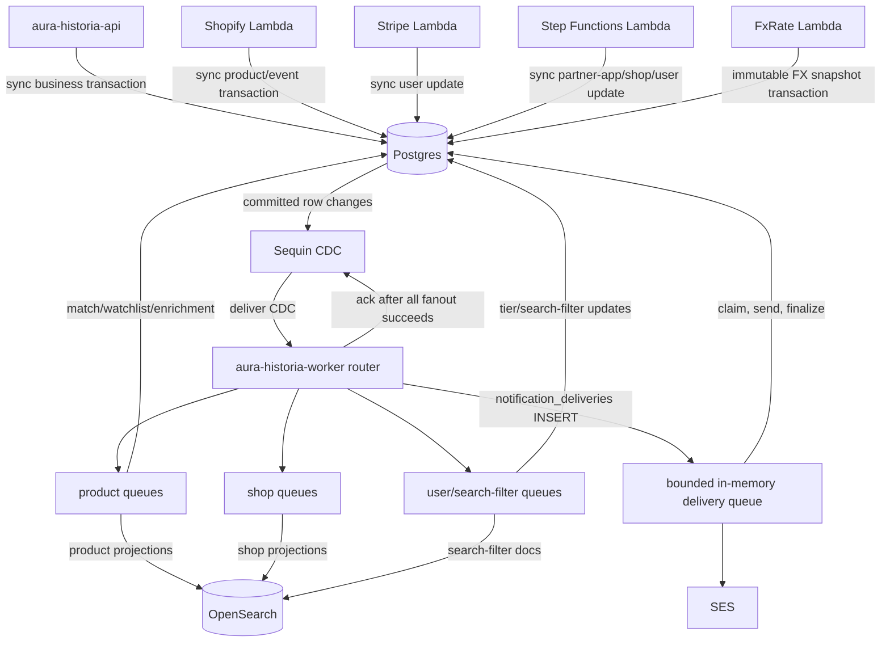
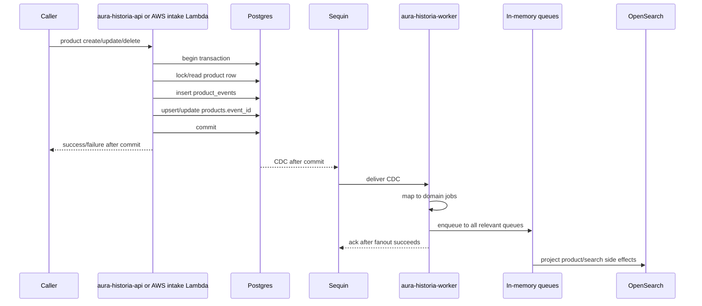

# Event Flow

This document describes the target event flow for #1341. Current AWS DynamoDB Stream/EventBridge/SQS/Lambda rails stay only for AWS survivor workflows until cutover.

See `docs/hetzner_postgres_sequin_migration.md` for the ADR.

## Target components

| Component | Type | Purpose |
|---|---|---|
| Postgres | Database | Business source of truth and transactional product/event writes. |
| `product_events` | Postgres table | Product domain/enrichment/policy/lifecycle event log. |
| `notification_deliveries` | Postgres table | Durable email-delivery intent and lease state. |
| Sequin | CDC | Delivers committed Postgres changes to worker ingestion. |
| `aura-historia-worker` router | Rust process | Maps CDC rows to domain jobs and fans them out to queues. |
| In-memory sub-worker queues | Worker buffers | Bounded execution buffers. Not durable. |
| OpenSearch | Search projection | Rebuildable product/shop/search-filter projection. |
| DynamoDB access tokens | AWS DynamoDB | Existing access-token storage and lookup. |
| FxRate Lambda | AWS Lambda | Captures immutable canonical EUR-base FX snapshots in Postgres. |
| Shopify Lambda | AWS Lambda | Handles Shopify events, writes Postgres directly. |
| Stripe Lambda | AWS Lambda | Handles Stripe subscription events, writes Postgres directly. |
| Step Functions | AWS workflow | Partner-shop-application workflow. |
| CloudWatch log-retention Lambda | AWS Lambda | Keeps AWS log retention policy. |

## Target routing diagram

## Product write flow

Product writes are synchronous and persist full immutable payload snapshots. Pricing retains only source `price`, `price_estimate_min`, and `price_estimate_max`; it never carries an FX ID. Creating or transitioning a Product to `SOLD` captures one `sold_at`, then selects latest persisted `captured_at <= sold_at` in the Product transaction and records immutable `sale_fx_rate_id` plus `sold_at`. Missing or invalid persisted FX data rejects the write. A sold Product can move only to `REMOVED` through generic writes, preserving its sale valuation. FX snapshots are a separate canonical context: each persisted generation stores one checked EUR-base `units_per_eur` quote for every supported currency, including EUR at scale. Capture fetches the provider before its short Postgres transaction, deduplicates by source event ID, and rejects retroactive or tied canonical captures.

No intermediate product command SQS queue. No `202 accepted because queued` behavior for migrated writes.

## Sequin fanout contract

`aura-historia-worker` exposes `POST /cdc/sequin` for CDC delivery.

There is no durable `worker_inbox` table.

Minimum ingest steps:

1. Receive CDC envelope.
2. Validate source/table/operation.
3. Build domain change from row keys and before/after values.
4. Derive domain-first `idempotency_key` and `ordering_key`.
5. Map change to one or more domain jobs.
6. Enqueue every job to every relevant bounded in-memory queue.
7. Return `202` to Sequin only after all enqueue operations succeed.
8. Return non-2xx when fanout fails so Sequin retries.

Crash rule:

- Crash before Sequin ack: Sequin redelivers.
- Crash after Sequin ack: queued in-memory jobs may be lost if the process dies before sub-workers finish.
- MVP accepts this risk; durable queue follow-up is #1558.
- No scheduled inconsistency checker or repair job is part of v1.

## CDC routing

| Source table | Operation | Route |
|---|---|---|
| `product_events` | INSERT | Product projector; percolator for domain/enrichment; watchlist notifications for canonical `PRODUCT_PRICE_CHANGED` / `PRODUCT_STATE_CHANGED`; embedding for `DOMAIN_CREATED`; translation for `ENRICHMENT_EMBEDDED`; delete cleanup for lifecycle delete. |
| `products` | INSERT/MODIFY/DELETE | No default downstream route. Product events are the projection trigger to avoid double-firing. Use products CDC only for future explicit non-event projections. |
| `shops` | INSERT/MODIFY/DELETE | Shop OpenSearch projector. Domains are inline in `shops.shop_domains`. Idempotency: `(shop_id, version, op)`. |
| `search_filters` | INSERT/MODIFY/DELETE | Search-filter OpenSearch sync for every persisted change; handlers reread the complete authoritative record. Idempotency: `(user_search_filter_id, version, op)`. |
| `search_filter_matches` | INSERT | Search-filter match notification worker. It rereads the exact persisted match and Product source, then inserts one PostgreSQL SearchFilter notification for that matching filter. Idempotency: `(user_id, user_search_filter_id, product_id, origin_event_id)`. |
| `notification_deliveries` | INSERT | Notification-delivery worker. It validates initial `EMAIL`/`PENDING` shape, claims the durable delivery lease with joined source in PostgreSQL, sends through S3 templates and SES, then finalizes that lease. Idempotency: `notification-delivery:{delivery_id}`; ordering: `notification:{notification_id}`; external delivery remains at-least-once across a send/finalize crash. |
| `users` | MODIFY | User tier enforcement for tier changes; no user OpenSearch projection. Idempotency: `(user_id, version)`. |
| `product_watchlist` | INSERT/MODIFY/DELETE | No default downstream route; product events drive notifications. |
| `partner_shop_applications` | INSERT/MODIFY | No generic worker route unless notification behavior requires it. |

## Domain jobs

Worker sub-jobs use domain payloads or compact IDs. They do not use DynamoDB stream records and should not depend on raw Sequin JSON outside the router.

Current router jobs carry compact domain refs. Sub-worker implementation issues must introduce typed DTOs/payloads where behavior depends on event/change fields. Those DTOs should be derived from Postgres/domain rows, not from Sequin envelopes.

Examples:

- `ProductEventJob`
- `ProductDeletedJob`
- `SearchFilterChangedJob`
- `ShopChangedJob`
- `UserTierChangedJob`
- `PeriodicMatcherJob`

## Target sub-workers

| Sub-worker | Replaces | Input | Side effects |
|---|---|---|---|
| Product OpenSearch projector | `product-lambda-materialize-opensearch` | Product event job | OpenSearch product document create/update/delete. |
| Product delete cleanup | `product-lambda-delete-product` | Lifecycle deleted job | OpenSearch delete, Postgres watchlist/match cleanup. |
| Watchlist notification generator | retired notification Lambda path | Price/state product event job | PostgreSQL watchlist notification inserts, one per semantic reason. |
| Notification delivery sender | PostgreSQL delivery flow | `notification_deliveries` insert job | Claims PostgreSQL delivery lease, sends S3-rendered email through SES, and finalizes durable delivery state. |
| Search-filter percolator | `search-filter-lambda-percolate-product` | Domain/enrichment product event job | Postgres matches only. |
| Search-filter match notification generator | Search-filter match notification path | Search-filter match inserted job | One PostgreSQL SearchFilter notification per matching filter. |
| Product embed | legacy `product-pipeline-embed-text` | `DOMAIN_CREATED` job | Postgres enrichment event + product update. Embedding stored in Postgres only. |
| Product translate | legacy `product-pipeline-translate` | Enrichment embedded job | Postgres `product_translations` upsert plus one translated-titles enrichment event and Product revision update. |
| Shop OpenSearch projector | `shop-lambda-opensearch-index` | Shop changed job | OpenSearch shop document write. |
| Search-filter OpenSearch sync | `search-filter-lambda-opensearch-sync` | Search-filter changed job | OpenSearch percolator document write/delete from complete Postgres state, with external source-version protection. Search-filter embedding stays in Postgres. |
| User tier enforcement | `user-lambda-tier-update` | User tier changed job | Postgres watchlist/search-filter state updates. |
| Periodic matcher | ECS periodic matcher | Scheduled job | Separate follow-up; it has no canonical notification role in this migration. |

The canonical Product OpenSearch projector, search-filter OpenSearch sync, search-filter percolator, search-filter match notification generator, watchlist notification generator, notification delivery sender, Product embedding worker, and Product translation worker are implemented in `aura-historia-worker`; the other listed target sub-workers remain migration targets until they have their own consumers.

## Canonical Product OpenSearch projection

PostgreSQL `products`, `product_translations`, and immutable `fx_rates` are authoritative. The `products` alias in OpenSearch is a rebuildable projection only. Each committed `product_events` insert creates a Product projection job with stable `(event_id, product_id)` IDs. The handler rereads full current Product state, rejects a trigger whose event ID is no longer current, and loads the exact sale snapshot only when a sale valuation has a main source price to convert. It commits its PostgreSQL read transaction, then writes the complete private document with `products.projection_version` as OpenSearch external version. A `LIFECYCLE_DELETED` current Product produces a versioned target delete. Duplicate and older writes return a stale no-op; a required missing sale snapshot fails the job for retry.

The document stores native `sourcePrice`, all immutable HalfUp `salePrices` only when a sale valuation has a main source price, and the valuation metadata independently. Thus a sold no-main-price document has `saleFxRateId` and `soldAt`, but no `sourcePrice` or `salePrices`; it remains searchable by non-price criteria and maps to a `SALE` summary with no display price. All existing search fields and the authoritative embedding remain. It never stores estimates. Product search cursor chains and single similar-Product KNN reads pin one persisted snapshot for active summary conversion; sold summaries use the indexed immutable sale amount when present and always preserve sale basis. Run the `product-opensearch` scope with `POSTGRES_*`, `OPENSEARCH_ENDPOINT_URL`, and OpenSearch credentials outside local development. Its Sequin subscription must contain only `product_events` inserts.

## Canonical Product embedding

The product-embedding scope accepts only `product_events` inserts and enqueues only `DOMAIN_CREATED`. Its service use case rereads the committed Product source and requires `products.event_id` to equal the trigger event ID. It supplies the title, optional description, and first image URL to neutral `embedding` before opening a short PostgreSQL transaction. The configured embedding adapter owns provider-specific prompt format. The writer locks and rechecks the Product revision, stores the normalized 768-float vector, appends `ENRICHMENT_EMBEDDED` with source-event provenance and title, and advances `products.event_id` atomically. Exact redelivery is target-side duplicate detection; superseded source events are stale no-ops.

Worker deployment uses `AURA_HISTORIA_WORKER_SCOPE=product-embedding`; it requires `POSTGRES_*`, `VERTEX_AI_PROJECT_ID`, `VERTEX_AI_LOCATION`, and Google ADC. It does not require `VERTEX_AI_MODEL`: the neutral embedding adapter owns its provider model. Its Sequin subscription must contain only `product_events` inserts. Provider calls happen before the write transaction; failures create no partial Product state.

## Canonical Product translation

The product-translation scope accepts only `product_events` inserts and enqueues only `ENRICHMENT_EMBEDDED`. Its service use case rereads the committed source and requires `products.event_id` to equal the trigger event ID before invoking the configured neutral `large-language-model` translator. It translates a non-empty native title into the supported target languages other than the source language, then opens a short PostgreSQL transaction. The writer locks the Product, rechecks the source revision, upserts provenance-bearing `product_translations`, appends one `ENRICHMENT_TRANSLATED_TITLES` batch event, and advances `products.event_id` atomically. Redelivery is target-side idempotent: identical source/provenance/title rows return duplicate without a second event; superseded source events return stale without writes.

Worker deployment uses `AURA_HISTORIA_WORKER_SCOPE=product-translation`; it requires `POSTGRES_*`, `VERTEX_AI_PROJECT_ID`, `VERTEX_AI_LOCATION`, `VERTEX_AI_MODEL`, and Google ADC. Its Sequin subscription must contain only `product_events` inserts. LLM calls happen before the short PostgreSQL write transaction; provider failures are retried by the worker and do not create partial translation state.

## Canonical search-filter percolator

The percolator scope accepts only `product_events` inserts. It enqueues only `DOMAIN` and `ENRICHMENT` Product events, rereads the committed typed Product match source including immutable `product_events.event_time`, and invokes `MatchProductEventUseCase`. The use case compares the source event ID with `products.event_id` before percolating; a superseded trigger is skipped, never evaluated against newer Product state with its old origin ID. For an accepted current event with a main source price, it uses the immutable sale snapshot when present; otherwise it reads latest persisted FX with `captured_at <= origin_event_time`, ordered by capture then generation. It converts the price into every supported currency only in the private temporary percolation document. Stored filter queries remain FX-independent. Current events percolate the canonical OpenSearch filter projection, then batch enhanced candidates through the neutral typed `large-language-model` capability. The service owns the product-match prompt, structured response schema, typed response mapping, retry policy, and first-five-product-image policy; the capability owns Vertex protocol, credentials, image fetch, generic output deserialization, and its configured provider model. The worker selects that model through required `VERTEX_AI_MODEL` configuration, not use-case code. The use case authoritatively rereads active candidates and stores every active idempotent plain or successful-enhanced match. An enhanced candidate failure never prevents those writes: retryable timeout, transport, 429, 5xx, and malformed-response failures return after commit for normal worker retry; permanent provider 4xx failures are explicit in the use-case result and never create a match. Vertex requests use a 10-second connect and 30-second total timeout, bounded concurrency, at most five product-image fetches per evaluation request, structured JSON, and reasons in the filter search language.

Worker deployment uses `AURA_HISTORIA_WORKER_SCOPE=search-filter-percolator`; its Sequin subscription must contain only `product_events` inserts. `POLICY` and `LIFECYCLE` events are acknowledged without a percolator job. Product-event redelivery is safe through the match uniqueness key; price matches retain `EVENT` or `SALE` snapshot provenance, while non-price matches retain null valuation provenance. Processed, duplicate, stale, missing-source, and ignored-event outcomes are recorded separately. FX capture has no percolation, Product projection, match, or notification route.

## Search-filter match notification generator

The match-notification scope accepts only `search_filter_matches` inserts. Its job and source read use `(user_id, user_search_filter_id, product_id, origin_event_id)`, so a stale or superseded CDC row cannot notify a different match. It reads the committed Product source and invokes `GenerateSearchFilterMatchNotificationUseCase` for every persisted matching filter. Missing or mismatched match sources are benign stale inputs. The use case locks the user tier and calculates the event's stable monthly notification rank; this gates delivery eligibility only, never match persistence. PostgreSQL inserts the notification and optional email-delivery row atomically. Exact CDC redelivery and concurrent filters are protected by the SearchFilter semantic identity, so each matching filter remains distinct.

Worker deployment uses `AURA_HISTORIA_WORKER_SCOPE=search-filter-match-notification`; its Sequin subscription must contain only `search_filter_matches` inserts. Match updates and deletes have no notification route.

Enhanced search filters use the canonical Vertex AI Gemini implementation of the neutral typed `large-language-model` capability. Timeout, transport, 429, 5xx, and malformed-response failures are retryable worker failures after plain/successful matches commit. Other provider 4xx failures are permanent candidate failures. The worker never treats an enhanced filter as matched or silently bypasses evaluation.

## Canonical watchlist notification generator

The watchlist worker scope accepts only `product_events` inserts and enqueues canonical price/state events. Its product-service use case rereads the immutable event plus current Product source and all active recipients, then inserts PostgreSQL notifications. Watchlist semantic identity is `(user_id, origin_event_id, kind)`, so a price change and state change remain distinct. Recipients with email disabled receive the in-app notification without a `notification_deliveries` row.

Duplicate webhook delivery is safe through the PostgreSQL semantic unique index. No currency conversion is invented: price-change payloads carry only each stored source price; rendering localizes from current user preferences.

Worker deployment uses `AURA_HISTORIA_WORKER_SCOPE=watchlist-notification`; its Sequin subscription must contain only `product_events` inserts. The default `search-filter-projection` scope remains separately subscribed to `search_filters`.

## Canonical notification delivery

The `notification-delivery` scope accepts only `notification_deliveries` inserts. Its Sequin job carries `notification_delivery_id` and `notification_id`, with idempotency `notification-delivery:{delivery_id}` and ordering `notification:{notification_id}`. The service atomically claims the durable lease and loads joined notification, recipient, first-name, language, and currency source from PostgreSQL; it commits before S3 or SES I/O, then conditionally finalizes the same lease. Missing, delivered, permanently failed, and actively leased rows are explicit acknowledged no-ops. Retryable send failures return the row to `PENDING` and fail the job for bounded retry; permanent failures become `FAILED`. A send/finalize crash can produce a duplicate external email, so email delivery is at-least-once.

Worker deployment uses `AURA_HISTORIA_WORKER_SCOPE=notification-delivery`; it requires `POSTGRES_*`, `S3_BUCKET_NAME_TEMPLATES`, `NOTIFICATION_EMAIL_FROM`, `NOTIFICATION_EMAIL_REPLY_TO`, `STAGE`, `COMMIT_SHA`, and AWS credentials with template-read plus SES-send permissions. Configure one Sequin subscription for `notification_deliveries` `INSERT` only. There is no SQS in this delivery route.

## Canonical search-filter OpenSearch projection

`search_filters` in Postgres is authoritative. `user_search_filters` is the single rebuildable canonical OpenSearch projection.

- This worker's Sequin subscription is scoped to `search_filters`; any other table is rejected before acknowledgment rather than being accepted into an unconsumed queue.
- The worker routes every committed `search_filters` insert, update, and delete to `SearchFilterOpenSearch` with `(user_search_filter_id, version, operation)`.
- The projection worker treats insert/update CDC rows as invalidations: it rereads complete committed Postgres state, maps all ProductSearch fields, and compiles the requested price range directly against private temporary `priceByCurrency.<currency>` fields. It writes with OpenSearch external versioning from `search_filters.version`; FX capture alone never writes saved filters.
- `search_filters` uses `REPLICA IDENTITY FULL` so delete CDC carries the old owner and version. Deletes use the deterministic successor external version (`search_filters.version + 1`) as a target tombstone. Older or equal target versions return a conflict and are recorded as stale no-ops.
- A malformed CDC row without the identifier, owner, or version is rejected so Sequin retries; it is never silently skipped.

The worker's in-memory post-ack loss window remains an explicit MVP risk. Recreate `user_search_filters` from Postgres when repair is needed.

## AWS survivor event flow

These AWS event flows stay:

| Source | Route | Target |
|---|---|---|
| Compute-stack creation or EventBridge schedule | bootstrap or cron | `fxrate-lambda`; captures one idempotent canonical FX snapshot in Postgres per source event ID |
| Shopify partner EventBridge/SQS | Shopify product events | `shopify-lambda`; this is external intake buffering before sync Postgres product/event writes, not the removed product command queue. |
| Stripe partner EventBridge | subscription events | `stripe-lambda`; Lambda invokes canonical User service handlers with direct Postgres adapters for atomic user tier/customer updates. |
| Step Functions | partner app workflow | `partner-shop-application-lambda`; Lambda writes Postgres business rows directly. |
| CloudWatch log group events | EventBridge | CloudWatch log-retention Lambda |

## Idempotency

Prefer domain IDs or domain versions over Sequin IDs.

Minimum unique keys:

| Area | Key |
|---|---|
| Product event | `product_events.event_id` |
| Product materialized state | `products.event_id` |
| Product worker job | `product_events.event_id` |
| Scheduled or deployment-bootstrap FX snapshot | `fx_rates.source_event_id` |
| Shop worker job | `(shop_id, version, op)` |
| Search-filter worker job | `(user_search_filter_id, version, op)` |
| User tier worker job | `(user_id, version)` |
| Search-filter match job | `(user_id, user_search_filter_id, product_id, origin_event_id)` |
| Search-filter match | `(user_search_filter_id, product_id)` plus `origin_event_id` FK to `product_events.event_id` |
| Search-filter notification | `(user_id, user_search_filter_id, product_id, origin_event_id)` PostgreSQL unique index |
| Watchlist notification | `(user_id, origin_event_id, kind)` PostgreSQL unique index |
| Notification delivery job | `notification-delivery:{delivery_id}`; order `notification:{notification_id}` |

Sequin ID/LSN can be logged for debugging, but do not make it the normal idempotency key when a domain key exists.

External sends remain at-least-once. Notification duplicate protection is at record creation, not SES delivery.

## Retry and failure handling

MVP has no worker-owned Postgres tables.

- No durable inbox.
- No processed-job table.
- No dead-letter table.
- No scheduled inconsistency checker or repair job.

Sub-workers may retry transient failures while the process is alive. Exhausted retries move to an in-memory DLQ helper for logging/metrics while the process remains alive. If the process dies after Sequin ack, queued or DLQ jobs can be lost. This accepted MVP risk is tracked by #1558.

## Operations notes

Postgres is business truth and Sequin depends on replication health. Production cutover needs backup/restore, WAL/PITR or accepted RPO, Sequin replication lag monitoring, worker queue/error alerts, and Postgres connection monitoring.

## Test guidance

- Use Postgres integration tests for repositories.
- Use fake CDC envelopes for router fanout tests.
- Use `test-api` Sequin helpers for real Sequin webhook delivery tests when CDC behavior matters.
- Use existing LocalStack OpenSearch for projection/percolator tests.
- Keep DynamoDB and CDK/CloudFormation helpers for AWS survivor tests.
