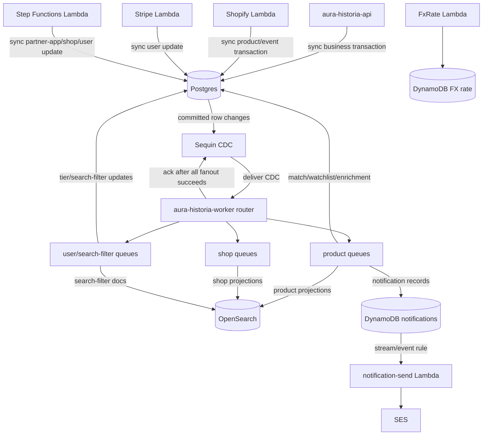
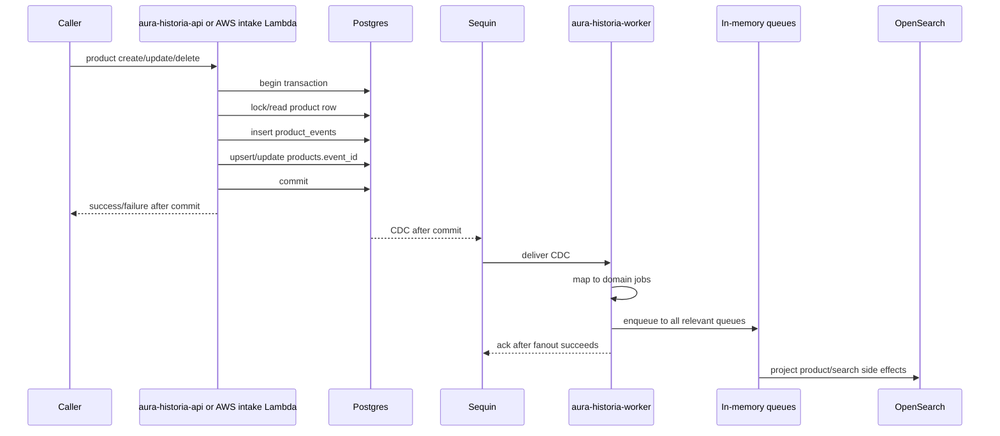

# Event Flow

This document describes the target event flow for #1341. Current AWS DynamoDB Stream/EventBridge/SQS/Lambda rails stay only for AWS survivor workflows until cutover.

See `docs/hetzner_postgres_sequin_migration.md` for the ADR.

## Target components

| Component | Type | Purpose |
|---|---|---|
| Postgres | Database | Business source of truth and transactional product/event writes. |
| `product_events` | Postgres table | Product domain/enrichment/policy/lifecycle event log. |
| Sequin | CDC | Delivers committed Postgres changes to worker ingestion. |
| `aura-historia-worker` router | Rust process | Maps CDC rows to domain jobs and fans them out to queues. |
| In-memory sub-worker queues | Worker buffers | Bounded execution buffers. Not durable. |
| OpenSearch | Search projection | Rebuildable product/shop/search-filter projection. |
| DynamoDB notifications | AWS DynamoDB | Notification TTL and insert-to-send behavior. |
| DynamoDB access tokens | AWS DynamoDB | Existing access-token storage and lookup. |
| `notification-send` | AWS Lambda | Sends external notifications through SES. |
| FxRate Lambda | AWS Lambda | Updates FX rates in DynamoDB. |
| Shopify Lambda | AWS Lambda | Handles Shopify events, writes Postgres directly. |
| Stripe Lambda | AWS Lambda | Handles Stripe subscription events, writes Postgres directly. |
| Step Functions | AWS workflow | Partner-shop-application workflow. |
| CloudWatch log-retention Lambda | AWS Lambda | Keeps AWS log retention policy. |

## Target routing diagram

## Product write flow

Product writes are synchronous.

No intermediate product command SQS queue. No `202 accepted because queued` behavior for migrated writes.

## Sequin fanout contract

`aura-historia-worker` exposes `POST /cdc/sequin` for CDC delivery.

There is no durable `worker_inbox` table.

Minimum ingest steps:

1. Receive CDC envelope.
2. Validate source/table/operation.
3. Build domain change from row keys and before/after values.
4. Derive domain-first `idempotency_key` and `ordering_key`.
5. Map change to one or more domain jobs.
6. Enqueue every job to every relevant bounded in-memory queue.
7. Return `202` to Sequin only after all enqueue operations succeed.
8. Return non-2xx when fanout fails so Sequin retries.

Crash rule:

- Crash before Sequin ack: Sequin redelivers.
- Crash after Sequin ack: queued in-memory jobs may be lost if the process dies before sub-workers finish.
- Crash after Sequin ack may lose queued in-memory jobs.
- MVP accepts this risk.
- No scheduled inconsistency checker or repair job is part of v1.

## CDC routing

| Source table | Operation | Route |
|---|---|---|
| `product_events` | INSERT | Product projector; percolator for domain/enrichment; watchlist notifications for price/state; enrichment pipeline for create/embed; delete cleanup for lifecycle delete. |
| `products` | INSERT/MODIFY/DELETE | No default downstream route. Product events are the projection trigger to avoid double-firing. Use products CDC only for future explicit non-event projections. |
| `shops` | INSERT/MODIFY/DELETE | Shop OpenSearch projector. Domains are inline in `shops.shop_domains`. Idempotency: `(shop_id, version, op)`. |
| `search_filters` | INSERT/MODIFY/DELETE | Search-filter OpenSearch sync for search/embedding/language/currency/state/notifications changes. Idempotency: `(user_search_filter_id, version, op)`. |
| `search_filter_matches` | INSERT/MODIFY/DELETE | No default downstream route. `origin_event_id` links to `product_events.event_id`. |
| `users` | MODIFY | User tier enforcement for tier changes; no user OpenSearch projection. Idempotency: `(user_id, version)`. |
| `product_watchlist` | INSERT/MODIFY/DELETE | No default downstream route; product events drive notifications. |
| `partner_shop_applications` | INSERT/MODIFY | No generic worker route unless notification behavior requires it. |

## Domain jobs

Worker sub-jobs use domain payloads or compact IDs. They do not use DynamoDB stream records and should not depend on raw Sequin JSON outside the router.

Examples:

- `ProductEventJob`
- `ProductDeletedJob`
- `SearchFilterChangedJob`
- `ShopChangedJob`
- `UserTierChangedJob`
- `PeriodicMatcherJob`

## Target sub-workers

| Sub-worker | Replaces | Input | Side effects |
|---|---|---|---|
| Product OpenSearch projector | `product-lambda-materialize-opensearch` | Product event job | OpenSearch product document create/update/delete. |
| Product delete cleanup | `product-lambda-delete-product` | Lifecycle deleted job | OpenSearch delete, Postgres watchlist/match cleanup. |
| Watchlist notification generator | `product-lambda-update-notify-user` | Price/state product event job | DynamoDB notification inserts. |
| Search-filter percolator | `search-filter-lambda-percolate-product` | Domain/enrichment product event job | Postgres matches, DynamoDB notifications. |
| Product embed | `product-pipeline-embed-text` | Domain created job | Postgres enrichment event + product update. Embedding stored in Postgres only. |
| Product translate | `product-pipeline-translate` | Enrichment embedded job | Postgres enrichment event + product update. |
| Shop OpenSearch projector | `shop-lambda-opensearch-index` | Shop changed job | OpenSearch shop document write. |
| Search-filter OpenSearch sync | `search-filter-lambda-opensearch-sync` | Search-filter changed job | OpenSearch percolator document write/delete. Search-filter embedding stored in Postgres only. |
| User tier enforcement | `user-lambda-tier-update` | User tier changed job | Postgres watchlist/search-filter state updates. |
| Periodic matcher | ECS periodic matcher | Scheduled job | OpenSearch product search, Postgres matches, DynamoDB notifications. |

## AWS survivor event flow

These AWS event flows stay:

| Source | Route | Target |
|---|---|---|
| DynamoDB notification insert | Stream/EventBridge/SQS | `notification-send` Lambda |
| EventBridge schedule | cron | `fxrate-lambda` |
| Shopify partner EventBridge/SQS | Shopify product events | `shopify-lambda`; this is external intake buffering before sync Postgres product/event writes, not the removed product command queue. |
| Stripe partner EventBridge | subscription events | `stripe-lambda` |
| Step Functions | partner app workflow | `partner-shop-application-lambda`; Lambda writes Postgres business rows directly. |
| CloudWatch log group events | EventBridge | CloudWatch log-retention Lambda |

## Idempotency

Prefer domain IDs or domain versions over Sequin IDs.

Minimum unique keys:

| Area | Key |
|---|---|
| Product event | `product_events.event_id` |
| Product materialized state | `products.event_id` |
| Product worker job | `product_events.event_id` |
| Shop worker job | `(shop_id, version, op)` |
| Search-filter worker job | `(user_search_filter_id, version, op)` |
| User tier worker job | `(user_id, version)` |
| Search-filter match | `(user_search_filter_id, product_id)` plus `origin_event_id` FK to `product_events.event_id` |
| Notification | user + origin event where domain allows |

Sequin ID/LSN can be logged for debugging, but do not make it the normal idempotency key when a domain key exists.

External sends remain at-least-once. Notification duplicate protection is at record creation, not SES delivery.

## Retry and failure handling

MVP has no worker-owned Postgres tables.

- No durable inbox.
- No processed-job table.
- No dead-letter table.
- No scheduled inconsistency checker or repair job.

Sub-workers may retry transient failures while the process is alive. Exhausted retries move to an in-memory DLQ helper for logging/metrics while the process remains alive. If the process dies after Sequin ack, queued or DLQ jobs can be lost. This risk is accepted for MVP.

## Operations notes

Postgres is business truth and Sequin depends on replication health. Production cutover needs backup/restore, WAL/PITR or accepted RPO, Sequin replication lag monitoring, worker queue/error alerts, and Postgres connection monitoring.

## Test guidance

- Use Postgres integration tests for repositories.
- Use fake CDC envelopes for router fanout tests.
- Use existing LocalStack OpenSearch for projection/percolator tests.
- Keep DynamoDB and CDK/CloudFormation helpers for AWS survivor tests.
