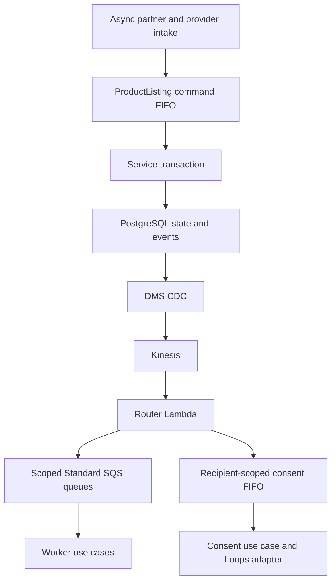

# Event flow

This document owns event sources, routing and consumer completion semantics.
[Architecture](../arch.md#12-cdc-and-projection-architecture) owns general rules;
the [worker runbook](../durable-worker-runbook.md) owns activation and recovery.
Code and configuration define exact codecs and resource settings, not live state.

## Delivery paths

```mermaid
flowchart TD
    Writes[Service transaction] --> PG[PostgreSQL state and events]
    PG --> DMS[DMS CDC]
    DMS --> Kinesis[Kinesis]
    Kinesis --> Router[Router Lambda]
    Router --> Standard[Scoped Standard SQS queues]
    Router --> Consent[Recipient-scoped consent FIFO]
    Standard --> Workers[Worker use cases]
    Consent --> Loops[Consent use case and Loops adapter]
    Intake[Async partner and provider intake] --> Commands[ProductListing command FIFO]
    Commands --> Writes
```

Command admission and committed-change delivery are separate boundaries. An API
success may confirm a transaction or queue custody; neither implies search visibility
or external delivery. PostgreSQL remains authoritative. DMS start and router activation
require the [infrastructure procedure](../infra.md#cdc-and-scheduled-work).

## ProductListing write flow

- Partner writes commit canonical state and at most one semantic event atomically.
  The immutable domain/enrichment journal is the projection source, not a generic
  outbox or an event-sourced aggregate. [ProductListing](../product-listing.md) owns
  lifecycle, sale-observation and event meaning.
- Crawler and provider observations capture separate raw evidence and immutable
  revisions. Only ordered normalization turns those revisions into canonical state
  and events. It preserves listing-owned Auction/lot facts; it does not mutate Auctions.
- Raw-revision jobs are wake-ups: normalization drains the authoritative stream head
  and commits terminal progress with any canonical change. Invalid candidate data
  may be terminally rejected; dependency/configuration failures leave work pending.
  Capped or unfinished drains are not complete. There is no scheduled raw-backlog reconciler.
- Async partner commands and mapped Shopify/WooCommerce observations use a separate
  ProductListing FIFO. The consumer commits canonical state/event or raw capture
  together with its successful command receipt. [Admission, execution and retry identity](../product-listing.md#asynchronous-ingestion-submission)
  are independent of downstream normalization and projection.

## CDC routing

The router consumes native Kinesis envelopes containing strict DMS records. It
validates the complete route and encoded jobs before any send, and checkpoints only
once every required publication is confirmed. Partial or uncertain fanout can duplicate
jobs. Failure stops at the earliest unconfirmed sequence; safe non-trigger operations
and informational controls produce no jobs. Invalid rows and incompatible schema
controls retain failure custody rather than being silently skipped. The DMS-generated
`create-table` control for `awsdms_apply_exceptions` in the empty target schema is
informational and creates no jobs; this exception does not accept its data records,
other schema operations or unknown tables.

The DMS adapter decodes a serialized JSONB `product_listing_events.payload` once
before shared event validation; already-object payloads follow the same validation.
Malformed JSON, non-object values, unsupported versions and invalid event fields
retain failure custody. Other row fields and raw evidence are not decoded into
jobs. This transport conversion preserves event identity and retry keys.

Discovery title validation accepts the same bounded legacy trailing whitespace
as PostgreSQL readers: removing only trailing whitespace must produce a nonempty
canonical title, and the stored value must remain within the title length limit.
Other noncanonical text retains failure custody. Routing does not rewrite the
immutable payload, source sequence or compact job identity.

| Selected source | Trigger | Consumer |
| --- | --- | --- |
| `product_listing_events` | INSERT | Product projector and saved-filter percolator; additional routes below |
| `product_listing_raw_revisions` | INSERT | Normalization only |
| `search_filters` | INSERT / UPDATE / DELETE | Saved-filter projector |
| `search_filter_matches` | INSERT | Match-notification generator |
| `notification_deliveries` | INSERT | Notification delivery |
| `marketing_email_consent_sync_intents` | INSERT | Recipient-scoped consent FIFO |

Product event fanout:

| Event | Additional consumers |
| --- | --- |
| `PRODUCT_LISTING_DISCOVERED` | Content assessment, embedding, translation |
| `PRODUCT_LISTING_CHANGED` | Watchlist for main-price/availability changes; embedding for image changes |
| `ENRICHMENT_EMBEDDED`, `ENRICHMENT_TRANSLATED_TITLES` | None beyond projector/percolator; no enrichment loop |

Combined change dimensions route to the union of their consumers. Canonical listing
rows, Users, watchlist entries, Auction events, proofs and operational receipts do not
implicitly trigger these routes. In particular, a User update is not a subscription job.

Consent CDC is deliberately minimized: INSERT/UPDATE carry only `intent_id` and
`recipient_key`; DELETE carries only the primary key under default replica identity.
Only INSERT produces work; extra fields fail validation even on non-trigger operations.
Email, profile, proof, source keys, leases and provider data must not enter this CDC path.

Jobs use schema version **2** and typed application IDs; version 1 is rejected.
ProductListing event payloads have their own version, independent of the job envelope.
Jobs carry compact identity/revision metadata, never CDC rows or raw evidence. The
`CAPTURE_RAW` command is a separate, explicitly designed evidence boundary; provider
credentials, signatures and signed request headers still never enter it.

Exact route and wire definitions live in [CDC routing](../../src/aura-historia-cdc-routing/src/lib.rs),
[router decoding](../../src/cdc-router-lambda/src/cdc.rs) and [job codecs](../../src/aura-historia-jobs/src/).

## Consumer completion and fences

Workers invoke service use cases and acknowledge only confirmed completed outcomes.
Duplicates, authoritative stale skips and deliberately ignored inputs may complete;
missing required source, active leases, malformed jobs, dependency failure or uncertain
commit/effect do not. SQS transport IDs are not business idempotency keys.

| Consumer | Authority and completion rule |
| --- | --- |
| Product projection | Reread complete current PostgreSQL state; reject superseded event triggers; write at the projection version. |
| Saved-filter projection | Reread complete filter state for upserts; a missing row or delete writes a successor-version tombstone. Delete CDC retains owner/version; acknowledge only confirmed applied/stale completion. |
| Content assessment | Commit against the evaluated content-source revision; do not manufacture a domain event or write search directly. |
| Embedding / translation | Evaluate outside a transaction, then recheck the corresponding source marker and commit guarded enrichment. First committed completion wins; its journal entry drives projection. |
| Percolation | Evaluate only an active current source event. Recheck the listing and each filter's evaluated semantic inputs before committing idempotent matches. |
| Match notification | Read the exact persisted match and its historical origin, not a newer match or current-event substitute; commit notification and delivery intent together. |
| Watchlist notification | Use immutable event time and current active/notification-enabled intervals; later activation cannot earn an older notification. Suppress currently withdrawn listings. |
| Notification delivery | Commit a fenced claim before sending; finalize the same claim/result and acknowledge only confirmed terminal completion. |
| Marketing consent | Claim the exact intent, revalidate permission and reconcile provider outcomes; see [consent synchronization](../marketing-consent.md#synchronization-and-provider-eligibility). |

Product and saved-filter projections use externally versioned, content-free
`projectionDeleted: true` tombstones. Readers exclude them; older/equal writes cannot
resurrect deleted state. Tombstones must outlive physical-delete version memory.
[Rebuild and deletion recovery](../durable-worker-runbook.md#projection-fences-and-rebuild)
require authoritative facts and fenced writers, not an index reset.

Matching uses persisted FX, not live rates. Historical sold valuations use the pinned
observation; other event-price evaluations use an eligible snapshot at event time.
Enhanced-classifier failures are not negative matches: successful candidates can commit
before retryable failures return. No scores or generated explanations become match facts.
FX capture alone does not trigger percolation, projection or notification.

## Provider and scheduled flows

| Intake | Boundary and acknowledgment |
| --- | --- |
| WooCommerce | Signed HTTP intake plus partner authorization → command FIFO. A mapped webhook acknowledges confirmed admission, not raw capture; authorized ignored inputs create no command/receipt. |
| Shopify | Partner EventBridge → retained provider Standard queue → Shopify Lambda → command FIFO. Forwarding and command application are separate acknowledgments and failure locations. |
| Stripe | Partner EventBridge → dedicated Lambda → User-service reconciliation. Provider reads occur between short PostgreSQL transactions; receipts, tier changes and entitlement reconciliation commit together. |
| Cognito pre-sign-up | Federated collision checks fail closed. Linking requires the explicit provider trust policy and verified persisted identity; email alone is insufficient. |
| Cognito post-confirmation | Registration commits the initial User/binding. Profile bootstrap applies only on first creation; replay does not synchronize profile or restore consent. [Signup consent](../marketing-consent.md#grants-and-double-opt-in) is a separate verified decision. |
| Loops | Exact-byte signed HTTP event → atomic preference application/receipt. See [preference webhooks](../marketing-consent.md#preference-webhooks). |
| Cleanup / FX | Scheduler invokes bounded use cases. Expiry is enforced on use; cleanup is not an authorization check. FX occurrences keep stable retry identity. |
| Periodic matching | Scheduler starts a one-shot Fargate task. Per-filter checkpoints advance after completed work; persisted matches feed the ordinary notification route. |
| Log retention | AWS log-group creation invokes the retention handler; narrowly configured evidence groups are exempt. It does not grant business runtimes log-administration rights. |

The Cognito collision policy is provider-specific: Google linking requires verified
incoming and destination identities; Facebook collisions are rejected, and a profile
linked to Facebook is not a Google-link destination. The database's email uniqueness
remains the race barrier. [Identity recovery](../infra.md#manual-operations) must preserve
the existing bound account. PostConfirmation errors propagate but do not roll back
Cognito confirmation; there is no durable queue/DLQ for that registration boundary.
Unsettled PostgreSQL registration therefore needs operator recovery.

### Stripe subscription reconciliation

Subscription created, updated and deleted events request a fresh customer/subscription
read; their snapshots do not directly assign tiers. Stripe [does not guarantee event
ordering](https://docs.stripe.com/event-destinations/eventbridge#event-ordering), and
second-resolution event timestamps cannot establish a total order.

The Stripe event ID identifies a durable receipt. Reusing it with different canonical
content, customer or subscription identity fails closed. Receipts are retained for replay
safety. Identical completed deliveries skip provider I/O. A customer reconciliation
revision advances on every completed new event, including unchanged tiers. If another
reconciliation commits during a provider read, the older reader must retry from current
state. Provider failures, malformed selected events, unknown users and identity conflicts
remain failures for Lambda’s asynchronous retry policy. This route currently has no
configured asynchronous failure destination; exhausted retries require operator replay
from retained provider event evidence.

Current `active`, `trialing` and `past_due` subscriptions grant the highest configured
product tier across the customer's subscriptions. `past_due` retains access during
payment recovery; canceled, unpaid, incomplete, expired and paused subscriptions grant
none. Unknown statuses/products and incomplete responses fail closed. Subscription
pagination is explicit and the entire provider read has a bounded deadline. Customer
metadata may establish an unbound user's association but cannot replace another customer
or contradict an existing user's association.

Before running the updated consumer, apply the Stripe receipt migration and provide its
`STRIPE_API_KEY` configuration using the existing stage credential reference. The consumer
and billing API share that key: restricted permissions must preserve customer creation
and Checkout/billing-portal session creation, plus customer and subscription reads.
The key, product/price identifiers and event destination must use the same Stripe account
and test/live environment. No transaction stays open across Stripe I/O; a failed
application rolls back its receipt and revision together with business changes.

## Operations and validation

[Worker operations](../durable-worker-runbook.md) distinguish router archives, worker
DLQs, upstream provider failures and scheduled-task failures. Infrastructure declarations
and fixtures do not prove delivery. Observe real mapping states, lag, backlog and completed
outcomes before retiring a producer or enabling traffic.

Tests should cover strict CDC decoding, fanout, duplicate/reordered work, stale source
markers, uncertain commits, FIFO partial failure, notification finalization and deletion
fences/rebuilds. Use isolated real dependencies where needed; live probes require approval.
