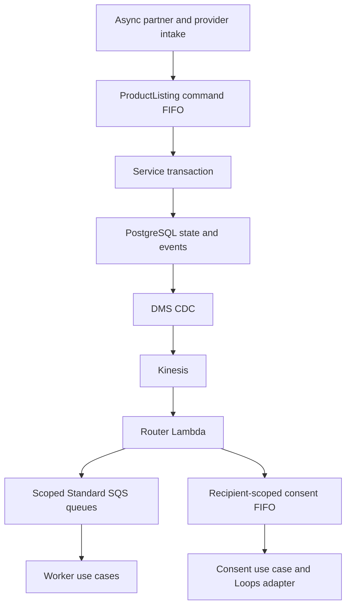

# Event flow

This document owns event sources, routing and consumer completion semantics.
[Architecture](../arch.md#12-cdc-and-projection-architecture) owns general rules;
the [worker runbook](../durable-worker-runbook.md) owns activation and recovery.
Code and configuration define exact codecs and resource settings, not live state.

## Delivery paths

```mermaid
flowchart TD
    Writes[Service transaction] --> PG[PostgreSQL state and events]
    PG --> DMS[DMS CDC]
    DMS --> Kinesis[Kinesis]
    Kinesis --> Router[Router Lambda]
    Router --> Standard[Scoped Standard SQS queues]
    Router --> Consent[Recipient-scoped consent FIFO]
    Standard --> Workers[Worker use cases]
    Consent --> Loops[Consent use case and Loops adapter]
    Intake[Async partner and provider intake] --> Commands[ProductListing command FIFO]
    Commands --> Writes
```

Command admission and committed-change delivery are separate boundaries. An API
success may confirm a transaction or queue custody; neither implies search visibility
or external delivery. PostgreSQL remains authoritative. DMS start and router activation
require the [infrastructure procedure](../infra.md#cdc-and-scheduled-work).
Routine application delivery leaves DMS running and preserves selected-source identity,
strict router shapes, retained-message readers and intentional consumer/schedule activation.
Any captured relation DDL, capture selection/topology change or consumer retirement requires
reviewed maintenance through the same environment admission hold. Stopping DMS does not
drain Kinesis/SQS, discard retained contracts or authorize a new slot/start position; use
[controlled maintenance and recovery](../durable-worker-runbook.md#approved-dms-maintenance).

## Account identity deletion

Account removal atomically appends `user_identity_deletion_requests`. DMS selects only
its deleted user ID; provider identities and delivery state stay outside CDC. Inserts
route schema-1 `USER_IDENTITY_DELETION` jobs to the isolated `user-identity-deletion`
Standard queue. The worker rereads retained identity state and acknowledges only committed
completion. Unknown targets, active claims and uncertain provider effects remain retryable.
[Account lifecycle](../account-lifecycle.md) owns provider and re-registration rules;
[worker recovery](../durable-worker-runbook.md#user-identity-deletion-recovery) owns redrive.

## Shipping management signals

[Shipping](../shipping.md#immutable-management-change-signals) owns version 1 immutable
profile/default signals, retained deletion fences and protected history. Only the
minimal address-free signals atomically coalesce durable shipping dependency work.
Terms, evidence, creation receipts and original signals remain outside ordinary CDC.
Only `listing_shipping_wakeups` (work UUID and positive bigint generation) is selected;
schema-1 `LISTING_SHIPPING` jobs target the isolated `listing-shipping` worker scope.
Workers reread current committed dependencies and checkpoint bounded pages. See the
[projection contract](../shipping.md#effective-shipping-discovery-projection) and
[recovery runbook](../durable-worker-runbook.md#listing-shipping-recovery).

## ProductListing write flow

- Partner writes commit canonical state and at most one semantic event atomically.
  The immutable domain/enrichment journal is the projection source, not a generic
  outbox or an event-sourced aggregate. [ProductListing](../product-listing.md) owns
  lifecycle, sale-observation and event meaning.
- Crawler and provider observations capture separate raw evidence and immutable
  revisions. Only ordered normalization turns those revisions into canonical state
  and events. It preserves listing-owned Auction/lot facts; it does not mutate Auctions.
- Raw-revision jobs are wake-ups: normalization drains the authoritative stream head
  and commits terminal progress with any canonical change. Invalid candidate data
  may be terminally rejected; dependency/configuration failures leave work pending.
  Capped or unfinished drains are not complete. There is no scheduled raw-backlog reconciler.
- Optional [crawler shipping assertions](../shipping.md#deterministic-crawler-item-assertions)
  apply through the existing delivery use case after catalog normalization commits.
  Their failures do not undo terminal raw progress. Existing shipping change and validity
  signals retain their ordinary transaction boundaries.
- Async partner commands and mapped Shopify/WooCommerce observations use a separate
  ProductListing FIFO. The consumer commits canonical state/event or raw capture
  together with its successful command receipt. [Admission, execution and retry identity](../product-listing.md#asynchronous-ingestion-submission)
  are independent of downstream normalization and projection.
- Provider observations of one source record are ordered by provider source time. An
  older observation completes as stale. Provider clocks are often second-precise, so
  distinct observations with an equal source time keep FIFO admission order, except that
  an upsert never overtakes a delete with the same source time. A delete without a source
  time sets a barrier at the later of its capture time and every source time already known
  for the record; only an observation with a later source time moves past it, earlier ones
  complete as stale and a timestamp-free upsert is rejected. The barrier compares provider
  and database clocks: provider skew can delay a restore until the next edit, or let an
  update older than the delete by less than the skew restore the listing.

### Shopify channel observations

Catalog intake accepts `product_listings/add`, `product_listings/update` and
`product_listings/remove`, scoped to the subscribing app's sales channel. Add/update
snapshots use `product_listing.product_id`, without product `status`; stock exhaustion
updates availability and does not withdraw the listing. Remove requires only that exact
positive unsigned 64-bit product identity. The mapper preserves it exactly and emits a
validated decimal `sourceListingId` in raw values for both upsert and delete. Source
identity always includes the `ListingSourceId`.
A first remove can bind an existing canonical backfill listing by this source/product pair;
unknown products retain their ordering fence without creating a canonical listing.

`SHOPIFY_PRODUCT` payload schema 2 retains the nested listing snapshot, stripping
`body_html` inside `product_listing` (and at the outer level). Raw-values schema 1 is
unchanged. Unsupported schemas fail closed. Broad `products/*` topics are acknowledged
without forwarding, including queue redrives.

`X-Shopify-Triggered-At` continues to supply webhook source-time ordering independently
of product `updated_at`, using the existing provider ordering and deletion-barrier rules
above. Provider receipt and command deduplication remain unchanged.

Initial/manual/recovery imports use the existing canonical asynchronous upsert and
withdrawal endpoints. The app owns publication reads: imports upsert published products
and withdraw only drafts, archived products and unpublished products present in the
export, each by its own ID, never by absence. An empty export submits no withdrawals.
Missing access/publication and failed or partial reads are recoverable errors.

Bulk writes and webhooks have no shared ordering guarantee. An older import can restore
a product removed by a later webhook; an older withdrawal can remove a product republished
later. This overlap is an accepted limitation, and importing again is the recovery path.
Existing idempotency keys prevent duplicate command application; they do not establish
publication chronology.

App companion [#370](https://github.com/aura-historia/shopify-app/issues/370) owns
publication filtering, subscription/scope changes and imports through the existing API.
Deployment order is in the
[worker runbook](../durable-worker-runbook.md#shopify-channel-deployment).

## Geography dependency invalidation

Party service owns `party_location_changes`; ListingSource service owns
`listing_source_location_default_changes`. Each minimal immutable revision signal commits
with its authoritative semantic mutation. Default signals contain source/operator and
optional location identities, assignment/location revision, applicability flags, actor
and occurrence time, without address, point or evidence. Duplicate current-revision
no-ops emit nothing; clearing emits a null selection and preserves the ordering fence.
Location/default rows and receipts remain outside CDC. Exact persistence and
inheritance semantics belong to [geography](../geography.md#listingsource-location-defaults-2000).

These signals atomically establish coalesced durable listing-geography work. The
`listing_geography_wakeups` table alone adds CDC/job routing; the original journals stay
outside DMS. Consumers reread current authority under dependency equality guards and
use the listing's monotonic projection fence. Location correction, retirement,
source replacement/clear and provider rights/expiry refresh current read state without
rewriting historical listing assertions. Missing authority produces absence. See the
[effective geography contract](../geography.md#effective-listing-geography-2003) and
[recovery runbook](../durable-worker-runbook.md#listing-geography-recovery).

## CDC routing

The router consumes native Kinesis envelopes containing strict DMS records. It
validates the complete route and encoded jobs before any send, and checkpoints only
once every required publication is confirmed. Partial or uncertain fanout can duplicate
jobs. Failure stops at the earliest unconfirmed sequence; safe non-trigger operations
and informational controls produce no jobs. Invalid rows and incompatible schema
controls retain failure custody rather than being silently skipped. The DMS-generated
`create-table` control for `awsdms_apply_exceptions` in the empty target schema is
informational and creates no jobs; this exception does not accept its data records,
other schema operations or unknown tables.

The DMS adapter decodes a serialized JSONB `product_listing_events.payload` once
before shared event validation; already-object payloads follow the same validation.
Malformed JSON, non-object values, unsupported versions and invalid event fields
retain failure custody. Other row fields and raw evidence are not decoded into
jobs. This transport conversion preserves event identity and retry keys.

| Selected source | Trigger | Consumer |
| --- | --- | --- |
| `product_listing_events` | INSERT | Product projector; additional routes below |
| `product_listing_raw_revisions` | INSERT | Normalization only |
| `search_filter_matches` | INSERT | Match-notification generator |
| `notification_deliveries` | INSERT | Notification delivery |
| `marketing_email_consent_sync_intents` | INSERT | Recipient-scoped consent FIFO |
| `geo_resolution_wakeups` | INSERT | Geographic resolution worker |
| `listing_geography_wakeups` | INSERT | Effective listing geography worker |
| `listing_shipping_wakeups` | INSERT | Effective listing shipping worker |

Product event fanout:

| Event | Additional consumers |
| --- | --- |
| `PRODUCT_LISTING_DISCOVERED` | Content assessment, embedding, translation |
| `PRODUCT_LISTING_CHANGED` | Watchlist for main-price/availability changes; embedding for image changes |
| `ENRICHMENT_EMBEDDED`, `ENRICHMENT_TRANSLATED_TITLES`, `ENRICHMENT_GEOGRAPHY_UPDATED`, `ENRICHMENT_SHIPPING_UPDATED`, `ENRICHMENT_CONTENT_ASSESSED` | None beyond product projector; no enrichment loop |

Combined change dimensions route to the union of their consumers. Canonical listing
rows, saved-filter configuration, Users, watchlist entries, Auction events, proofs and
operational receipts do not implicitly trigger these routes. In particular, a User update
is not a subscription job.

Consent CDC is deliberately minimized: INSERT/UPDATE carry only `intent_id` and
`recipient_key`; DELETE carries only the primary key under default replica identity.
Only INSERT produces work; extra fields fail validation even on non-trigger operations.
Email, profile, proof, source keys, leases and provider data must not enter this CDC path.

Geographic resolution CDC selects only the immutable resolution ID/generation wake-up
table, with exact decimal-string generations. All operations reject extra columns.
Private inputs, cache fingerprints, tenant scope, review choices and provider evidence
remain outside CDC. Resolution claims/completions reread PostgreSQL; old generations
complete as superseded and active leases retain retry custody. Hourly backend cleanup
supplies recovery for missed deliveries by advancing runnable pending generations and
inserting fresh immutable wake-ups, preserving attempts and budget reservations. It
also purges ineligible evidence and commits invalidation. Cleanup makes no provider
calls; fresh recovery wake-ups require the normal CDC/SQS path to be healthy.
Accepted evidence and the content-free enrichment/invalidation journal commit together.
Dependency journal inserts atomically coalesce effective-listing-geography work.
Only its compact work ID/generation wake-ups participate in CDC; private source
evidence, addresses, resolution payloads and checkpoints do not. See [durable geography](../geography.md#durable-resolution-and-party-integration-2002).
Cached reuse emits a subject-specific RESOLVED signal for a new source binding;
source revision changes clear reviewed geography and atomically emit INVALIDATED,
including when they retain the same resolution identity. Unchanged binding replays are silent.

Jobs use schema version **1** and typed application IDs; other versions are rejected.
ProductListing event payloads have their own version 1, independent of the job envelope.
Both discovered and changed events may include `delivery`; a discovered assertion must be
complete, and a change must contain both previous and current values. Delivery-only
changes project the listing without triggering price/availability watchlist
notifications or image embedding. Protected delivery terms never enter ordinary jobs or
public history. All ingestion operations, including `CHANGE_DELIVERY`, use envelope
version 1 with strict codecs, verified semantic fingerprints and stable retry identities.
Jobs carry compact identity/revision metadata, never CDC rows or raw evidence. The
`CAPTURE_RAW` command is a separate, explicitly designed evidence boundary; provider
credentials, signatures and signed request headers still never enter it.

Exact route and wire definitions live in [CDC routing](../../src/aura-historia-cdc-routing/src/lib.rs),
[router decoding](../../src/cdc-router-lambda/src/cdc.rs) and [job codecs](../../src/aura-historia-jobs/src/).

## Consumer completion and fences

Workers invoke service use cases and acknowledge only confirmed completed outcomes.
Duplicates, authoritative stale skips and deliberately ignored inputs may complete;
missing required source, active leases, malformed jobs, dependency failure or uncertain
commit/effect do not. A FIFO consumer moves a job that can never succeed as delivered into
its own DLQ on redelivery and acknowledges it only once the transfer is confirmed
([failure custody](../durable-worker-runbook.md#failure-custody-and-controlled-redrive)).
SQS transport IDs are not business idempotency keys.

| Consumer | Authority and completion rule |
| --- | --- |
| ProductListing commands | Apply with the command receipt. Deterministic [business rejections](../product-listing.md#downstream-command-execution) complete without a receipt; invalid commands, identity conflicts and invalid persisted state move to the DLQ on redelivery; other failures retain only their own FIFO message group. |
| Product projection | Reread complete current PostgreSQL state; reject superseded event triggers; write at the projection version. |
| Content assessment | Commit against the evaluated content-source revision; do not manufacture a domain event or write search directly. An effective apply/clear appends `ENRICHMENT_CONTENT_ASSESSED` (exactly `{}`) and advances listing freshness and the projection fence; duplicates, stale results and empty clears do not. |
| Embedding / translation | Evaluate outside a transaction, then recheck the corresponding source marker and commit guarded enrichment. First committed completion wins; its journal entry drives projection. |
| Match notification | Read the exact persisted match and its historical origin, not a newer match or current-event substitute; commit in-app notification and digest membership (or legacy delivery intent) together. |
| Watchlist notification | Use immutable event time and current active/notification-enabled intervals; later activation cannot earn an older notification. Suppress currently withdrawn listings. |
| Notification delivery | Commit a fenced claim before sending; finalize the same claim/result and acknowledge only confirmed terminal completion. |
| Marketing consent | Claim the exact intent, revalidate permission and reconcile provider outcomes; an undecodable job or missing intent moves to the DLQ on redelivery. See [consent synchronization](../marketing-consent.md#synchronization-and-provider-eligibility). |
| Geographic resolution | Reserve a bounded, database-budgeted claim; call the provider outside transactions; commit permitted evidence and its signal under the same unexpired claim/generation. Negative outcomes have reconsideration deadlines; provider/configuration failures retain failure custody. |

ProductListing projections use externally versioned, content-free
`projectionDeleted: true` tombstones. Readers exclude them; older/equal writes cannot
resurrect deleted state. Tombstones must outlive physical-delete version memory.
[Rebuild and deletion recovery](../durable-worker-runbook.md#projection-fences-and-rebuild)
require authoritative facts and fenced writers, not an index reset.

FX capture alone does not enqueue matching, projection or notification, touch listing
freshness or widen the scheduled matching interval.

## Provider and scheduled flows

| Intake | Boundary and acknowledgment |
| --- | --- |
| WooCommerce | Signed HTTP intake plus partner authorization → command FIFO. A mapped webhook acknowledges confirmed admission, not raw capture; authorized ignored inputs create no command/receipt. Delivery IDs are unique only per webhook and second, so command and provider-receipt identity also bind the product and the sanitized evidence digest; the randomly sampled `related_ids` is not evidence. |
| Shopify | Partner EventBridge → retained provider Standard queue → Shopify Lambda → command FIFO. Forwarding and command application are separate acknowledgments and failure locations. |
| Stripe | Partner EventBridge → dedicated Lambda → User-service reconciliation. Provider reads occur between short PostgreSQL transactions; receipts, tier changes and entitlement reconciliation commit together. |
| Cognito pre-sign-up | Federated collision checks fail closed. Linking requires the explicit provider trust policy and verified persisted identity; email alone is insufficient. |
| Cognito post-confirmation | Registration commits the initial User/binding. Profile bootstrap applies only on first creation; replay does not synchronize profile or restore consent. [Signup consent](../marketing-consent.md#grants-and-double-opt-in) is a separate verified decision. |
| Loops | Exact-byte signed HTTP event → atomic preference application/receipt. See [preference webhooks](../marketing-consent.md#preference-webhooks). |
| Cleanup / FX | Scheduler invokes bounded use cases. Expiry is enforced on use; cleanup is not an authorization check. FX occurrences keep stable retry identity. |
| Periodic matching | Scheduler starts a one-shot Fargate task; see [saved-filter matching](#periodic-saved-filter-matching). |
| Log retention | AWS log-group creation invokes the retention handler; narrowly configured evidence groups are exempt. It does not grant business runtimes log-administration rights. |

The Cognito collision policy is provider-specific: Google linking requires verified
incoming and destination identities; Facebook collisions are rejected, and a profile
linked to Facebook is not a Google-link destination. The database's email uniqueness
remains the race barrier. [Identity recovery](../infra.md#manual-operations) must preserve
the existing bound account. PostConfirmation errors propagate but do not roll back
Cognito confirmation; there is no durable queue/DLQ for that registration boundary.
Unsettled PostgreSQL registration therefore needs operator recovery.

### Periodic saved-filter matching

New saved-filter matches are discovered by scheduled runs for active ordinary and
enhanced filters. PostgreSQL owns filter configuration, permitted matching evidence,
progress, matches, feedback and notification eligibility. Creates, updates, reactivation
and subscription reconciliation resolve evidence under the authoritative user-tier lock:
Free permits title/description, Pro adds up to one image, Ultimate adds enhanced intent
when supplied and up to four images. Restricted filters remain inactive with authored
intent intact. A policy change increments the filter version even when its state stays
active; execution consumes that policy without loading subscriptions. Persisted intent
incompatible with its resolved capability fails validation instead of losing instructions.

Query-only intent uses the existing lexical search. Enhanced intent uses hybrid retrieval
with its write-time base-query + description embedding; the description is never appended
as a mandatory all-words title query. Filters containing only deterministic constraints
use ordinary search without embedding or model work. Structured predicates, including
geography, shipping, availability, source/auction and pinned-FX prices, constrain retrieval regardless
of classifier scores. Current authoritative event checks fence obsolete projection evidence.

Every filter, including shipping, geography and FX-converted shipping predicates, uses one
listing-`updated` interval: the lower bound is the later of filter creation and
`matched_through` minus the replay overlap, intersected with any authored `updated` range;
the upper bound is the window end capped by any authored maximum. An empty intersection skips
the filter. Because every persisted listing-state change, enrichment included, advances
[listing freshness](../product-listing.md#freshness), profile/default, geography and other
effective changes make older listings eligible again without a predicate-specific historical
scan. FX capture alone never does: an older listing outside the interval stays excluded even
if its converted shipping price now satisfies a threshold, while candidates inside the
interval use the run's pinned FX snapshot. Discovery remains bounded by scan/candidate limits
and projection lag. Private destination snapshots follow the
[shipping contract](../shipping.md#shipping-search-and-saved-destinations).

Each logical filter/window attempt scans at most 100 results, deduplicates listing identity
and skips existing matches, withdrawn listings and missing/stale sources before selecting
the first up to 50 eligible listings. Every selected semantic candidate receives its own
validated decision; negative decisions never stop evaluation or refill slots. Bounded retries reuse
the same selected identities. This is bounded best-effort discovery: exhaustion, candidate
cap and scan cap are reported separately. Advancing a window does not prove catalogue
coverage; the unselected tail has no guaranteed later opportunity.

The evaluator includes complete base-query alternatives and permitted enhanced instructions,
keeps requirements/exclusions distinct from preferences and treats listing/image text as
untrusted evidence. Missing evidence proves neither satisfaction nor contradiction. Images
cannot establish authenticity, provenance, authorship or age without supporting evidence.
`should_show >= SEARCH_FILTER_MATCH_SHOULD_SHOW_THRESHOLD_BPS / 10000` accepts an alert
(default 0.5, inclusive); the score is a decision signal, not a calibrated probability.
Every listing has exactly one `should_show` question. Text-only, one-image and four-image
requests may have different score behavior and require separate evaluation fixtures.

Text candidates from one saved filter may share one model request with a single canonical
intent/policy and separately delimited evidence. Request-local candidate/question IDs map
back to the application's frozen listing/event references; response order never supplies
identity. Provider-advertised question, conservative text/context and encoded-payload budgets
split requests before truncation, with additional shared-request headroom. No user criteria
or listing evidence are shortened to fit. Image-bearing evaluations retain singleton
requests, including the full permitted four-image selection; missing source images can
yield text-only requests, but fetched-image degradation never repacks a request.

Missing/malformed/out-of-range answers leave their candidate unresolved. Independently
complete answers survive only a trustworthy envelope; duplicate/unknown IDs invalidate
its mapping. Unresolved shared members receive at most one singleton recovery per attempt;
timeouts and rate limits use the existing bounded filter retry/backoff instead of immediate
fan-out. Both phases share the concurrency bound. Singleton and shared prompts have distinct
evaluator versions; future score reuse must honor that compatibility boundary and batch only
unresolved members of the original selection. Version aliases require an explicit quality
decision. [The quality gate](../durable-worker-runbook.md#saved-search-batching-quality-gate)
controls activation and fallback.

Image selection is primary-first, URL-deduplicated and policy-bounded. Free never fetches
images. Absent source media is normal; fetching/format/size failures degrade to the remaining
permitted evidence, including text-only, with requested/sent counts and omission reasons.
Exact prepared-image duplicates are omitted. The adapter enforces four images, per-image
and aggregate media/body limits and a conservative context bound before provider truncation.
A technical failure is never a negative semantic decision. Permanent candidate failures
are reported as terminal incomplete evaluations and permit bounded-window progress;
retryable failures leave progress unchanged even when accepted
matches commit. Only `CLASSIFIER_INVOCATION` events sum provider attempts and token costs;
`SAVED_SEARCH_MATCH_DECISION` events describe scores and decisions without duplicate costs.
Reports count selected identities separately from submitted classification requests
(including retries/preparation failures); actual provider attempts come only from the
invocation stream. Neither event logs private search text or image bytes.

A run excludes overlapping execution and uses projection lag and replay overlap. Image/model
work has bounded concurrency outside transactions; cancellation/timeouts and failed filters
remain incomplete task outcomes. The final short transaction rechecks filter version,
state/progress and current listing event before idempotent insertion. Matching pins persisted
FX at the window end and retains historical sale-observation valuations. An opted-in
shipping match separately retains immutable FX ID/capture time and target maximum, without
changing its private destination snapshot. Shipping valuation columns remain excluded from
CDC; notification wake-ups still carry match identifiers only. Existing source-currency predicates retain their
meaning. Subsequent FX captures do not rewrite matches or repeat their notifications.
Persisted match INSERTs feed the existing CDC notification route independently of external notification
eligibility and monthly quotas.

The [periodic use case](../../src/search-filter-service/src/use_cases/run_periodic_search_filter_matching.rs)
owns executable matching semantics; [periodic recovery](../durable-worker-runbook.md#periodic-matching-recovery)
owns operator checks.

### Saved-search email digests

Saved-search email uses one durable user/run group. PostgreSQL freezes the run's
intended filters and their versioned matching configuration before discovery. The
persisted window end is the logical run identity: resumed invocations finish that
run before starting another. Candidate selection, including an empty set, is also
frozen before evaluation so process restarts cannot refill the first-50 budget.
Successful, changed/inactive and superseded filters
are terminal; exhausted retries remain pending until recovery or the fixed 24-hour
run deadline. A user's group can finish independently of other users' failed filters.

New matches carry their run identity at insertion. The existing CDC generator still
selects each match under the authoritative user-tier lock and unchanged monthly
ranking (distinct origin events, creation time and event identity). Selection reads
its completion fence after acquiring that lock, including suppression and replay,
so concurrent attempts cannot reverse a committed terminal decision. Email grouping
and cross-filter display deduplication do not change that quota unit. Per-filter
matches, feedback and per-match in-app notifications retain their existing behavior.
Notification creation, eligible email membership snapshots and selection completion
commit together. Suppressed selections are terminal; failed transactions remain
recoverable. Repeated classifier evaluation and CDC replay cannot enroll an existing
match again.

Both filter completion and match notification selection attempt finalization for
their user/run in the same transaction as their completion marker. Finalization
locks the group before rereading readiness, so either completion order and
concurrent completions can enqueue delivery immediately once both are complete. It
waits for intended filter completion and notification selection of every persisted
match, then freezes all selected membership and inserts one delivery into the
existing notification outbox in the same transaction. Empty groups produce no
delivery. Concurrent finalizers reuse the same group; finalized membership never
changes. Unfinished older groups retain their own membership until finalization. A
late selected member of a finalized group remains unassigned for the next user/run
digest, without creating a second email for the old run. Hourly cleanup is the
recovery path: it recovers unfinished selection from authoritative matches and
finalizes ready or expired groups; failures retain their membership and retry
custody.

Delivery rereads current account status, filter ownership/active state/notifications,
listing existence/lifecycle/current event and current content assessment. Existing
image-consent presentation rules and recipient lookup apply. If no members remain
eligible, delivery ends with the existing missing-source suppression outcome, never
as delivered. Email snapshots retain localized content and search labels, while
current restrictions can remove members or images. Rendering orders cards by listing
identity and labels by filter identity, displays at most 20 distinct listings and
states the preview and total counts. All eligible per-filter members remain enrolled;
links lead to the complete saved searches and their notification settings. Text is
escaped through the existing renderer. No classifier instructions or diagnostics
enter the email payload.

The delivery lease, retry and provider acceptance semantics are unchanged. SES has
no idempotency token; a unique digest is one logical intent, not an exactly-once
external-email guarantee. See [notification recovery](../durable-worker-runbook.md#notification-recovery-limits)
for ambiguous sends and [digest recovery](../durable-worker-runbook.md#saved-search-digest-recovery-and-cutover)
for interrupted runs and cutover.

### Stripe subscription reconciliation

Subscription created, updated and deleted events request a fresh customer/subscription
read; their snapshots do not directly assign tiers. Stripe [does not guarantee event
ordering](https://docs.stripe.com/event-destinations/eventbridge#event-ordering), and
second-resolution event timestamps cannot establish a total order.

The Stripe event ID identifies a durable receipt. Reusing it with different canonical
content, customer or subscription identity fails closed. Receipts are retained for replay
safety. Identical completed deliveries skip provider I/O. A customer reconciliation
revision advances on every completed new event, including unchanged tiers. If another
reconciliation commits during a provider read, the older reader must retry from current
state. Provider failures, malformed selected events, unknown users and identity conflicts
remain failures for Lambda’s asynchronous retry policy. This route currently has no
configured asynchronous failure destination; exhausted retries require operator replay
from retained provider event evidence.

Current `active`, `trialing` and `past_due` subscriptions grant the highest configured
product tier across the customer's subscriptions. `past_due` retains access during
payment recovery; canceled, unpaid, incomplete, expired and paused subscriptions grant
none. Unknown statuses/products and incomplete responses fail closed. Subscription
pagination is explicit and the entire provider read has a bounded deadline. Customer
metadata may establish an unbound user's association but cannot replace another customer
or contradict an existing user's association.

Before running the updated consumer, apply the Stripe receipt migration and provide its
`STRIPE_API_KEY` configuration using the existing stage credential reference. The consumer
and billing API share that key: restricted permissions must preserve customer creation
and Checkout/billing-portal session creation, plus customer and subscription reads.
The key, product/price identifiers and event destination must use the same Stripe account
and test/live environment. No transaction stays open across Stripe I/O; a failed
application rolls back its receipt and revision together with business changes.

## Operations and validation

[Worker operations](../durable-worker-runbook.md) distinguish router archives, worker
DLQs, upstream provider failures and scheduled-task failures. Infrastructure declarations
and fixtures do not prove delivery. Observe real mapping states, lag, backlog and completed
outcomes before retiring a producer or enabling traffic.

Tests should cover strict CDC decoding, fanout, duplicate/reordered work, stale source
markers, uncertain commits, FIFO partial failure, notification finalization and deletion
fences/rebuilds. Use isolated real dependencies where needed; live probes require approval.

Effective geography appends schema-1 `ENRICHMENT_GEOGRAPHY_UPDATED` with exactly an empty
object payload only when compact derived values change, advancing listing freshness in the
same transaction. It routes to product projection, with no watchlist/price noise or
enrichment loop. Work continuations and crash recovery
are durable; see [listing geography recovery](../durable-worker-runbook.md#listing-geography-recovery).

### Shipping observation validity

Incremental shipping imports commit address-free shipping_validity_changes with their
observations/ownership. OBSERVED is independent of management/terms/listing semantic
revisions; AUTHORITY_CHANGED follows existing source/configuration or grant lifecycle changes.
Subject identity is a profile, source default, listing or source; defaults and sources use the
source ID. The subject kind, ID and revision identify an immutable signal. The owning
[shipping contract](../shipping.md#incremental-typed-imports) defines application/replay and
source authority. Shipping invalidation consumes these committed records without a refresh barrier,
rereads current state and tolerates duplicate/out-of-order signals. Profile/source-default
management signals, canonical listing events and geographic lifecycle/rights signals use
the same durable work basis. Neither original assertion content nor producer ownership
keys enter the CDC job.

Effective shipping appends schema-1 `ENRICHMENT_SHIPPING_UPDATED` with exactly `{}` only
when the public compact summary changes, or when an import accepts a new acquisition of
unchanged listing delivery terms (new listing-owned evidence without a canonical revision).
It advances listing freshness and the existing projection fence/current-event pointer and
routes only to the complete ProductListing projector. Canonical revision,
content/embedding source pointers and public history remain unchanged. Dependency-only
refreshes and redelivered acquisitions update nothing visible.
The event codec rejects unknown versions or payload fields. Deploy compatible event/job
readers, strict camelCase mappings and the isolated queue/consumer with the migration;
older readers cannot consume the new event or scope. Rebuild and lag semantics belong
to the [shipping contract](../shipping.md#effective-shipping-discovery-projection).
