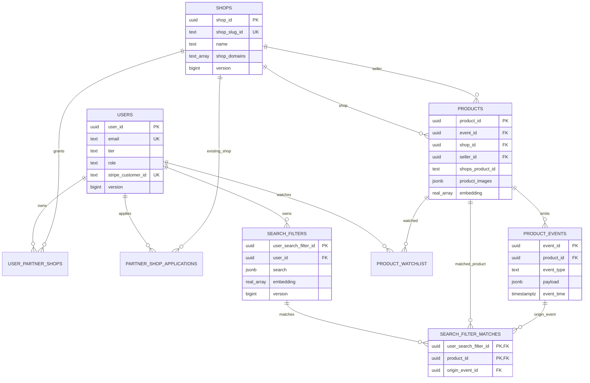

# Storage ownership

This repo is migrating most business truth from DynamoDB to Postgres as part of #1341.

See `docs/hetzner_postgres_sequin_migration.md` for the architecture ADR.

## Target owners

Postgres owns business truth for:

- users
- shops
- partner-shop-applications
- products
- product-events
- product-watchlist
- search-filters
- search-filter matches


DynamoDB keeps:

- notifications with TTL and insert-to-send behavior
- access tokens, as today
- OAuth clients
- OAuth authorization codes
- OAuth third-party exchange codes
- FX rate

OpenSearch keeps search projections only. It is rebuildable.

There is no target users OpenSearch index. Crawler storage is out of scope for this migration.

## Postgres runtime contract

Postgres is self-hosted. No RDS Proxy.

Runtimes receive explicit env vars:

- `POSTGRES_HOST`
- `POSTGRES_PORT`
- `POSTGRES_DATABASE`
- `POSTGRES_USERNAME`
- `POSTGRES_PASSWORD`
- `POSTGRES_MAX_CONNECTIONS`

Do not assume Postgres is on the same machine as API or worker.

## Migration location

The repo owns one Postgres business schema under:

```text
migrations/
```

Use sortable filenames:

```text
YYYYMMDDHHMMSS_short_description.sql
```

Migration files must be idempotent where integration tests re-run them (`CREATE TABLE IF NOT EXISTS`, `CREATE INDEX IF NOT EXISTS`). Prefer one shared schema because cross-domain relations are common.

## Repository pattern

For a Postgres-backed entity:

- Keep domain traits clean in the crate service/domain seam.
- Put SQL implementation under `src/<crate>/src/postgres/`.
- Name SQL DTOs `Row` when they represent DB rows.
- Handlers depend on service traits, not SQLx.
- Services may depend on repository traits, not concrete pool construction.
- Use typed errors with `thiserror`; map `sqlx::Error` at the repository edge.
- Use one repository/DAO per external source.
- Keep DynamoDB adapters only for DynamoDB-owned data.

Suggested shape:

```text
src/<crate>/src/postgres/mod.rs
src/<crate>/src/postgres/repository.rs
src/<crate>/src/postgres/<entity>_row.rs
migrations/...
```

## Schema map



## Schema draft

### Users

`users`

- `user_id uuid primary key`
- `email text not null unique`
- `first_name text null`
- `last_name text null`
- `language text null`
- `currency text null`
- `measurement_unit text null`
- `prohibited_content_consent boolean not null default false`
- `tier text not null`
- `role text not null`
- `stripe_customer_id text null unique`
- flattened address columns
- `geo_address_lat double precision null`
- `geo_address_lon double precision null`
- `version bigint not null default 1`
- audit columns: `created_by`, `updated_by`, `created`, `updated`

`user_partner_shops`

- `user_id uuid references users(user_id) on delete cascade`
- `shop_id uuid references shops(shop_id) on delete cascade`
- primary key `(user_id, shop_id)`

Access tokens stay in DynamoDB as today. Do not add `access_tokens` or `access_token_scopes` to Postgres.

### Shops

`shops`

- `shop_id uuid primary key`
- `shop_slug_id text not null unique`
- `name text not null`
- `shop_type text not null`
- `partner_status text not null`
- `shop_domains text[] not null default '{}'`
- `shopify_domain text null unique`
- `shopify_currency text null`
- `shopify_language text null`
- `woocommerce_webhook_secret text null`
- `woocommerce_currency text null`
- `woocommerce_language text null`
- `url text null`
- `view_url text null`
- `image text null`
- flattened address columns
- `geo_address_lat double precision null`
- `geo_address_lon double precision null`
- `phone text null`
- `email text null`
- `affiliate_configuration jsonb null`
- `version bigint not null default 1`
- audit columns

Indexes:

- GIN on `shop_domains` for domain lookup.
- `(partner_status, updated desc)` if needed by admin lists.

`shop_domains` is intentionally inline because domains are aggregate-owned values. Canonicalize domains in the repository. If strict global uniqueness per domain becomes mandatory at the database layer, re-normalize domains into a child table.

No `shop_raw_name_aliases` table. It is unused and should not be migrated.

### Partner shop applications

`partner_shop_applications`

- `partner_shop_application_id uuid primary key`
- `applicant_user_id uuid not null references users(user_id)`
- `business_state text not null`
- `execution_state text not null`
- `payload_type text not null`
- `existing_shop_id uuid null references shops(shop_id)`
- new-shop payload columns: name, type, domains, url, image, address, phone, email
- `task_token text null`
- `version bigint not null default 1`
- audit columns

Indexes:

- `(applicant_user_id, created desc)`
- `(business_state, created desc)`

### Products

`products`

- `product_id uuid primary key`
- `product_slug_id text not null`
- `shop_slug_id text not null`
- `seller_slug_id text not null`
- `event_id uuid not null references product_events(event_id)`
- `shop_id uuid not null references shops(shop_id)`
- `seller_id uuid not null references shops(shop_id)`
- `shops_product_id text not null`
- denormalized shop/seller name/type fields needed by search and notifications
- flattened address columns
- native title/description fields with language
- localized title fields: `title_de`, `title_en`, `title_fr`, `title_es`, `title_it`
- native and converted price fields
- native and converted estimate min/max price fields
- `state text not null`
- `lifecycle text not null`
- `url text not null`
- `view_url text not null`
- `product_images jsonb not null default '[]'`
- `embedding real[] null`
- `auction_start timestamptz null`
- `auction_end timestamptz null`
- audit columns

Constraints/indexes:

- unique `(shop_id, shops_product_id)`
- unique `(shop_slug_id, product_slug_id)`
- index `(seller_id)`
- index `(lifecycle, updated desc)`

`product_images` is intentionally inline because images are ordered aggregate-owned values and are not queried independently. Store objects with at least `position`, `url`, and optional `prohibited_content`.

`embedding` is stored only. Do not add ANN search or pgvector behavior until a later task explicitly needs it.

`product_events`

- `event_id uuid primary key`
- `product_id uuid not null references products(product_id)`
- `shop_id uuid not null`
- `shops_product_id text not null`
- `event_type text not null`
- `event_group text not null` (`DOMAIN`, `ENRICHMENT`, `POLICY`, `LIFECYCLE`)
- `payload jsonb not null`
- `event_time timestamptz not null`
- audit/write-source columns where useful

Indexes:

- `(product_id, event_time asc)`
- `(shop_id, shops_product_id, event_time asc)`
- `(event_type, event_time asc)` for worker routing

Product writes insert `product_events` and update `products` in one transaction.

### Product watchlist

`product_watchlist`

- `user_id uuid references users(user_id) on delete cascade`
- `product_id uuid references products(product_id) on delete cascade`
- `shop_id uuid not null`
- `shops_product_id text not null`
- `notifications boolean not null default true`
- `state text not null`
- audit columns
- primary key `(user_id, product_id)`

Indexes:

- `(user_id, created desc)`
- `(product_id)`
- unique `(user_id, shop_id, shops_product_id)`

### Search filters

`search_filters`

- `user_search_filter_id uuid primary key`
- `user_id uuid references users(user_id) on delete cascade`
- `name text not null`
- `notifications boolean not null default true`
- `state text not null`
- search criteria columns where stable and `search jsonb not null` for flexible criteria
- `enhanced_search_description text null`
- `embedding real[] null`
- `language text not null`
- `currency text not null`
- `last_hybrid_search_matched timestamptz not null default '1970-01-01T00:00:00Z'`
- `version bigint not null default 1`
- audit columns

Indexes:

- `(user_id, created desc)`
- `(state, updated desc)`

`embedding` is stored only. Do not add ANN search or pgvector behavior until a later task explicitly needs it.

`search_filter_matches`

- `user_id uuid not null references users(user_id) on delete cascade`
- `user_search_filter_id uuid not null references search_filters(user_search_filter_id) on delete cascade`
- `product_id uuid not null references products(product_id) on delete cascade`
- `shop_id uuid not null`
- `shops_product_id text not null`
- `origin_event_id uuid not null references product_events(event_id)`
- `user_search_filter_name text null`
- `enhanced_match_reason text null`
- `feedback boolean null`
- audit columns
- primary key `(user_search_filter_id, product_id)`

Indexes:

- `(user_id, created desc)`
- `(user_id, user_search_filter_id, created desc)`
- `(product_id)`
- `(origin_event_id)`
- unique `(user_id, user_search_filter_id, shop_id, shops_product_id)`

### Worker

No worker-owned Postgres tables in MVP.

- No `worker_inbox`.
- No `worker_processed_jobs`.
- No `worker_dead_letters`.
- No `worker_schedules`.

Sequin delivery is acknowledged after the router has delivered all derived domain jobs to the relevant bounded in-memory queues. If the worker process or host dies after ack, those in-memory jobs can be lost. MVP accepts this risk and does not add a scheduled inconsistency checker or repair job.

Use domain-first idempotency keys inside jobs and target writes where easy:

- product jobs: `product_events.event_id`
- shop jobs: `(shop_id, version, op)`
- search-filter jobs: `(user_search_filter_id, version, op)`
- user tier jobs: `(user_id, version)`
- match jobs: `(user_search_filter_id, product_id, origin_event_id)`


## Test pattern

Use `test-api` for repository integration tests:

```rust
use test_api::*;

const POSTGRES: Postgres = Postgres::new("migrations");

#[aura_integration_test(services = [POSTGRES])]
async fn should_persist_entity_when_valid() {
    let pool = get_postgres_client().await;
    // build repository with &pool
}
```

If seed data is needed:

```rust
const POSTGRES: Postgres = Postgres::with_setup_script(
    "migrations",
    "src/<crate>/tests/fixtures/setup.sql",
);
```

Keep existing LocalStack OpenSearch, DynamoDB, SQS, and CloudFormation helpers for AWS survivor and infra tests.

## Operations notes

Postgres is business truth. Production cutover needs backup/restore, WAL/PITR or accepted RPO, Sequin slot lag monitoring, connection monitoring, and migration rollback runbooks.

AWS survivor Lambdas connect to Postgres directly. Use TLS, tightly scoped credentials, small pools, and a reviewed network control such as allowlist, VPN, tunnel, or private overlay. Add PgBouncer or equivalent if Lambda concurrency can exceed safe Postgres connections.
